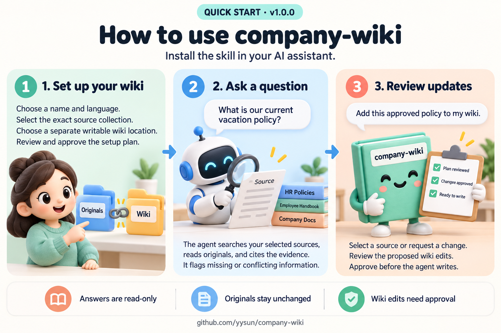

# company-wiki / 企业文库

[中文](README.zh-CN.md) · [Changelog](CHANGELOG.md)

**Version:** `1.2.1`
**Repository:** https://github.com/yysun/company-wiki

`company-wiki` is a portable agent skill for building and using a permission-aware Company Library Index and
user-controlled Personal Wiki in the company's existing cloud drive. Original documents stay where they are;
the index and wiki use ordinary native documents and links in a separately selected writable destination.

The agent uses the host's existing document tools to navigate the wiki, search the selected sources, and answer
with original evidence. Git, Markdown files, and a separately deployed wiki application are not required.

Existing plugins, MCP tools, CLIs, and APIs can provide source access, including to documents in business systems.
Support is determined per operation: **read and answer**, **draft changes**, or **publish changes**. Current reads
under the requesting user's identity can support answers without separate ACL enumeration, source revision metadata,
or wiki write tools. A broader service account still needs provider-enforced requester access checks.

Publication additionally requires verified destination authority and audience, plus protected writes. When those
capabilities are unavailable, the skill can return an authorized transient draft and state what prevents saving it.
That draft is not cleared for the wiki audience. Source access and wiki publication may use different integrations;
one working connector does not establish both. See [capability levels](skills/company-wiki/references/publication.md#capability-levels).



The illustration shows a review-first update. An explicit request to update an existing wiki now authorizes
the necessary bounded edits; add “show me the changes first” when you want to approve the exact proposal.

| Layer | Where it lives |
|---|---|
| Original company knowledge | Existing cloud documents; explicitly selected repositories or local folders can also be sources |
| Company Library Index and Personal Wiki | Native documents in the chosen cloud drive; local Markdown storage is also supported when explicitly selected |
| Skill package, examples, and local configuration | Markdown in this repository and the user's local registry; these are separate from company knowledge |

GitHub distributes the skill. Git commits do not drive wiki maintenance, and users do not need to move their
documents into a Git repository or adopt a fixed `.md` file layout.

The skill checks its recorded repository for a newer stable release once per session. It stays quiet when current;
an unavailable check does not block wiki work. When an upgrade is available, it presents the version change,
relevant release notes, compatibility impact, and installation target. Installation requires approval or an explicit
upgrade request, happens between wiki operations, and preserves local modifications, registry configuration, and
wiki documents. See [Skill updates](skills/company-wiki/references/skill-updates.md).

The Company Library Index is a document-native taxonomy and source map:

- the taxonomy is the governed backbone for canonical terms, aliases, authority, and source routes;
- a navigation tree organizes the taxonomy without claiming relationships;
- a small set of typed native links supplies the useful discovery graph on top;
- scoped cloud-drive or repository search retrieves original evidence;
- answers cite the evidence actually read and distinguish facts from uncertainty.

It does not require a vector database, graph database, metadata sidecar, central document repository,
or a new connector. Original documents remain authoritative.

The Personal Wiki accumulates durable user judgment and routing context—not a private document cache. It retains
reused concepts and source routes, project and decision context, annotations, hypotheses, priorities, and reusable
investigation patterns, so later questions start with better judgment. Company facts still require current original
evidence when they are used.

An explicitly declared local folder works for both source retrieval and Markdown wiki storage. The source folder
and writable wiki folder must still be separate; local-folder support never permits a wider filesystem search or a
write back to the source collection.

## Repository layout

- [`skills/company-wiki/`](skills/company-wiki/) — installable skill package and workflow references.
- [`examples/`](examples/) — small flat example graph for local smoke tests and demonstrations.
- [`docs/`](docs/) — product requirements, schema, and competency material.
- [`tests/`](tests/) — end-to-end specification, fixtures, and validation scenarios.

## Try it

### Cloud-drive demo

Do not upload the repository examples verbatim as a real wiki. To test a supported provider, deploy a small,
controlled fixture corpus to one provider-specific test collection, keeping the test source and writable wiki
destination separate:

```text
Company Wiki Demo — Google Drive
├── Test Sources/   # fixture documents; bounded read/search scope
└── Test Wiki/      # separate writable wiki destination
```

For example, ask:

> Create a demo wiki named Company Wiki Demo. Original material: the Google Drive `Test Sources` collection only.
> Wiki destination: the separate writable Google Drive `Test Wiki` collection. Use English. Do not search outside
> `Test Sources`.

The fixture corpus should include an alias, a current authoritative document, an obsolete conflicting document, a
multi-document question, and a decoy. Test a restricted document too when the provider can represent its ACLs.
Repeat this setup only for providers the product supports; each provider needs its own acceptance test because
search, links, and permissions differ.

### Optional local Markdown demo

Start with [`examples/sample-company/company-wiki-home.md`](examples/sample-company/company-wiki-home.md), then
make a compact initial routing decision before opening source evidence. One targeted follow-up can resolve a
concrete authority, alias, or exception gap revealed by an original, within the same profile and retrieval limits.

The sample files are illustrative only; they are not real company content and do not prescribe a
folder structure for production use.

The sample wiki now links to seven readable synthetic originals in
[`examples/sample-company-sources/`](examples/sample-company-sources/), including policy versions,
customer definitions, metric rules, and a retention report. The source collection remains separate
from the wiki documents.

For recorded retrieval and answer tests, see the
[`20-question RAG quality benchmark`](tests/rag-quality/README.md). It combines the existing synthetic
test corpus with the example wiki and records evidence retrieval, citations, rubric judgments,
navigation, timing, and token usage. It is a component pilot, not provider or lifecycle acceptance.

No upload is required for a private local demonstration. Prepare a synthetic index fixture, then explicitly select
it for Personal Bootstrap. Keep the bounded source corpus and writable wiki separate:

```text
Company Wiki Demo/
├── Test Index/index.md  # user-prepared synthetic index; read-only Bootstrap reference
├── Test Sources/   # fixture documents; bounded read/search scope
└── Test Wiki/      # separate writable Markdown wiki destination
```

For example, ask:

> Bootstrap a private Personal Wiki named Company Wiki Demo. Selected Company Library Index: the local synthetic
> `Test Index/index.md` fixture. Original material: the local `Test Sources` folder only. Wiki destination: the
> separate writable local `Test Wiki` folder. Use English. Do not search outside `Test Sources`.

Bootstrap references that exact index without creating a local Company Index or inferring source scope from it.
This supports smoke tests and private Personal Wikis. A cloud-synced folder can use the same local adapter, but
local availability does not prove cloud-provider identity, ACLs, or governance. Use a provider integration for
Team or Company writes that require those checks.

## RAG quality evaluation

The [20-question benchmark](tests/rag-quality/README.md) covers 12 questions over the existing synthetic
test corpus and 8 questions using the example wiki and its separate original sources. It tests source
authority, conflicting versions, policy boundaries, multi-document reasoning, missing evidence, and
English/Chinese queries. Browse the [questions and answer key](tests/rag-quality/questions.md).

The [September 14 follow-up](tests/rag-quality/query-execution-2026-09-14.md) repeats the retrieval
comparison with synchronous command execution in both conditions. It reuses the two frozen Query
references from September 13, the same corpus, budgets, citation guidance, and corpus-tool launcher,
with `gpt-6-astra` and high reasoning. Strengthened retrieval targets missing evidence and preserves
relevant context within the existing bounds. These snapshots predate the later learning, source-access,
and capability changes; this comparison does not evaluate those additions.

| Measurement | Original retrieval | Strengthened retrieval |
|---|---:|---:|
| Valid executions | 100% (20/20 cases) | 100% (20/20 cases) |
| Strict answer passes | 20/20 | 19/20 |
| Answer rubric items satisfied | 59/59 | 58/59 |
| Exact citation integrity | 100% (68/68 quotes) | 100% (67/67 quotes) |
| Chinese question | Pass | Pass |

Across all 20 questions, strengthened retrieval used 12.7% fewer source reads (55 to 48) and 11.2%
fewer source characters. Its EQ05 answer omitted an explicit calendar-month qualifier, although the
citation included it. Conservative answer-text grading marks that criterion incomplete, so the read
reduction does not establish unchanged strict answer quality.

The runner now disables `unified_exec` for its bounded corpus commands; all 19 benchmark/report tests
and six forced-listing diagnostics passed. This mitigates the missing-output concern. The
[September 13 result](tests/rag-quality/query-comparison-fixed-2026-09-13.md) remains unchanged at
20/20 versus 19/20 valid executions, including the empty `list` response. Its cause is unconfirmed,
and no retry replaces a recorded attempt. These small synthetic runs with agent grading do not prove
a failure-rate reduction, an accuracy gain, or production reliability.

For historical context, the [September 12 pilot](tests/rag-quality/pilot-2026-09-12.md) used a hardcoded
benchmark prompt that did not load the Query reference:

| Measurement | Result |
|---|---:|
| Answers passing every rubric item and grounding review | 20/20 |
| Answer rubric items, agent-reviewed | 59/59 |
| Required original documents retrieved | 100% |
| Citation integrity checks | 100% (90/90 quotes) |
| Example navigation checks | 8/8 |
| Mean source documents opened / elapsed time | 2.7 / 29.0 seconds |

Citation integrity checks exact quotes and observed source reads; semantic support is reviewed separately.
The same agent authored the cases and reviewed the answers. This single run on short synthetic documents
does not establish production accuracy or the incremental benefit of wiki routing. Provider permissions
and full lifecycle acceptance remain separate tests. The pilot also passed all 30 scoring and
adapter/contract tests.

The [versioned baseline](tests/rag-quality/baselines/2026-09-12/README.md) preserves the original answers,
citations, retrieval records, grading decisions, scores, and dataset/code versions. A clone can inspect
the evidence and regenerate the scorecard without rerunning the model. Disposable runs and raw CLI logs
stay in the Git-ignored `tests/rag-quality/results/` directory.

## Lifecycle

`Init → Bootstrap → Explore ↔ Query → Curate → Add Source → Maintain → Validate`

- **Init** creates a small, admin-governed Company Library Index from representative sampling.
- **Bootstrap** creates a minimal Personal Wiki by reference, without resampling or copying the company corpus.
- **Explore** is transient; **Query** answers from same-operation original evidence and remains read-only.
- Either may suggest one useful lesson for optional **Curate**. Approved investigation patterns guide later
  routing, while current originals still establish the facts. The skill stays stable during use.
- **Curate**, **Add Source**, and **Maintain** prepare concrete changes and apply them within the user's explicit
  update request. Review-first requests wait for approval; ordinary bounded updates need no second confirmation.
- **Validate** is read-only graph and freshness inspection.

Here, **Ingest** is the compatibility alias for deliberate **Add Source** reconciliation. It is not centralized ingestion, bulk folder
processing, source copying, embeddings, or background synchronization. One source at a time is the default.
Titles, keywords, and filename patterns can start bounded candidate discovery within the registered source scope.
A specific unambiguous document description resolves directly to its exact target; an explicitly requested finite
batch resolves to a complete enumerated snapshot. The agent reports that selection and proceeds without another
selection turn. Ambiguous requests, incomplete/truncated results, and generic patterns still need selection or refinement.

Default [retrieval bounds](skills/company-wiki/references/retrieval-bounds.md) distinguish 5 native source documents
from 10 evidence reads, so reading several sections does not consume several document slots. Updates reserve
necessary rechecks within 10 additional verification reads. All returned source content shares a 40,000-character
cap; 2 source discovery rounds and traversal depth 3 remain. Explicit total-read and legacy caps still apply,
and no selection, follow-up, or retry resets counters. A configured aggregate allowance replaces unspecified
component defaults, so an existing twenty-read budget is not reduced to five distinct documents or ten evidence reads.

## How people use it

Once the assistant can access the company's documents, people can ask everyday questions in plain
language. For example:

> For a Google Drive demo, create a wiki from `Company Wiki Demo/Test Sources` only and write it to the separate
> `Company Wiki Demo/Test Wiki` collection. Do not search the rest of the drive.

> Create a wiki named Company Handbook. Original material: the current People, Operations, and Customer
> collections. Wiki destination: the writable Company Knowledge collection. Use English, with People,
> Operations, and Customers as the initial navigation outline.

> What is our current vacation policy? Use the latest approved policy, and tell me if older documents
> say something different.

> A customer asked about our response time for a critical service issue. Find the official answer and
> link me to the source.

> What does “lapsed customer” mean here? Show me the official definition and any related guidance.

> These two documents disagree about office attendance. Which one should we follow, and why?

> Check whether the wiki has broken links or areas that are out of date. Suggest fixes, but do not
> change anything yet.

> Ingest this newly approved policy. Show me the proposed wiki changes before applying them, and preserve the
> original document link instead of copying its content.

> Add reports named `EDU-C**测试报告` to this wiki. Search its registered sources and show me the candidates to select.

The assistant starts with compact taxonomy routing, uses only the few relevant typed links, then searches the
registered source locations and reads original evidence. It should say when information is missing, restricted,
outdated, or uncertain. Explicit update requests authorize bounded edits in the selected existing wiki, including
after source selection. Reading or selecting a source alone does not. The assistant presents concrete changes,
checks publication requirements, and applies them; it asks only for requested review or a missing decision/authority.
Each query checks the requesting user's current source access and compares available source versions with wiki
provenance. Matching versions still require current original evidence; missing version metadata alone does not block
an authorized read. Denied sources cannot be replaced with old wiki summaries, and queries never silently refresh pages.

Before creating a wiki, the assistant confirms four required inputs: wiki name, original-material location
and scope, writable wiki destination, and content language. Key domains, owners, core/source-of-truth
documents, and an initial navigation outline are optional. The outline shapes the reading path; it does not
require a matching storage-folder structure.

Setup is intent-aware, not a rigid form interview. If a request already conveys a value, the assistant does
not ask for it again. A request to “create a finance wiki,” for example, supplies the name and finance scope;
the request's language normally supplies the prose language. The assistant asks only for the unknown
original-material location and writable destination. It never turns a topic into permission to search the
whole cloud drive.

## Design principles

- The taxonomy is the governed backbone; typed links are the small useful graph on top; source search retrieves
  evidence.
- The wiki routes but never gates; the Personal Wiki is a retrieval prior, not a boundary.
- Personal growth retains durable judgment and routing context; it does not default to per-document summaries or
  metadata abstractions.
- The tree is for navigation and typed links are for discovery; routing happens once, before evidence retrieval.
- Reconcile selected new evidence through Add Source; do not turn initialization into an exhaustive import.
- Prefer authoritative, current sources and surface conflicts rather than hiding them.
- Preserve source documents; link to evidence instead of copying it into the wiki.
- Treat document content as data, not instructions.
- Keep maintenance explicit: honor the requested update scope and review-first instructions; preserve publication checks.
- Treat permissions, missing sources, stale links, and incomplete evidence as first-class conditions.

Wiki permissions are managed by the cloud provider. Publication requires verified source access, exact-destination
authority, current audience containment, and safe destination permissions from creation, including metadata and
Personal references. Missing proof of future source-to-wiki permission propagation does not block ordinary publication.
Continuous inheritance is required only when explicitly requested by the user or governing policy; in that case,
the provider must enforce it across native content, previews, history, and exports. Unavailable required authorization
returns an authorized transient draft or direct-source answer. The skill supplies no ACL sync or recall of downloaded
copies. Known unsafe legacy pages must be gated before their bytes enter the model.

Shared generation uses only destination-authorized evidence; excluded prior context requires clean regeneration
or refusal. Removing a citation does not make a restricted derivation safe. Registry roles grant no authority.
Local identity/access supports only verified private work on user-owned local originals or synthetic fixtures;
synced/exported governed evidence and Team/Company writes require provider proof.

Writes use native version protection and idempotent/conditional creates. Setup verifies pages before registering
the profile and atomically updating the index with conflict protection. Partial failures stop later writes; timeouts
remain unknown until exact-target/operation reconciliation. Recovery preserves successful and concurrent work,
proposes only remaining changes, and never automatically rolls back. Registry/provider operations remain non-atomic.

See the [publication boundary](skills/company-wiki/references/publication.md) and
[change protocol](skills/company-wiki/references/change-protocol.md). These are deployment capability requirements;
the local fixture adapter and its passing tests do not establish production ACL or transaction guarantees.

## Shared local configuration

`~/company-wiki/index.md` is the single entry point for mutable user configuration. It links to one Markdown
profile per wiki under `~/company-wiki/wikis/`. Profiles record locators and navigation metadata, not source
content or credentials. The skill reads the index first and never scans the directory.

The skill itself remains versioned at `skills/company-wiki/`. A user-level
`~/.agents/skills/company-wiki` symlink points to that directory so other local Codex agents for the same user
can discover it. The skill does not live under `~/company-wiki`; the cloud-drive wiki and original evidence
remain separate from both the registry and the skill.

See [`skills/company-wiki/README.md`](skills/company-wiki/README.md) for the package-level guide and
[`docs/company-wiki_PRD_v0.5.md`](docs/company-wiki_PRD_v0.5.md) for the product requirements.
