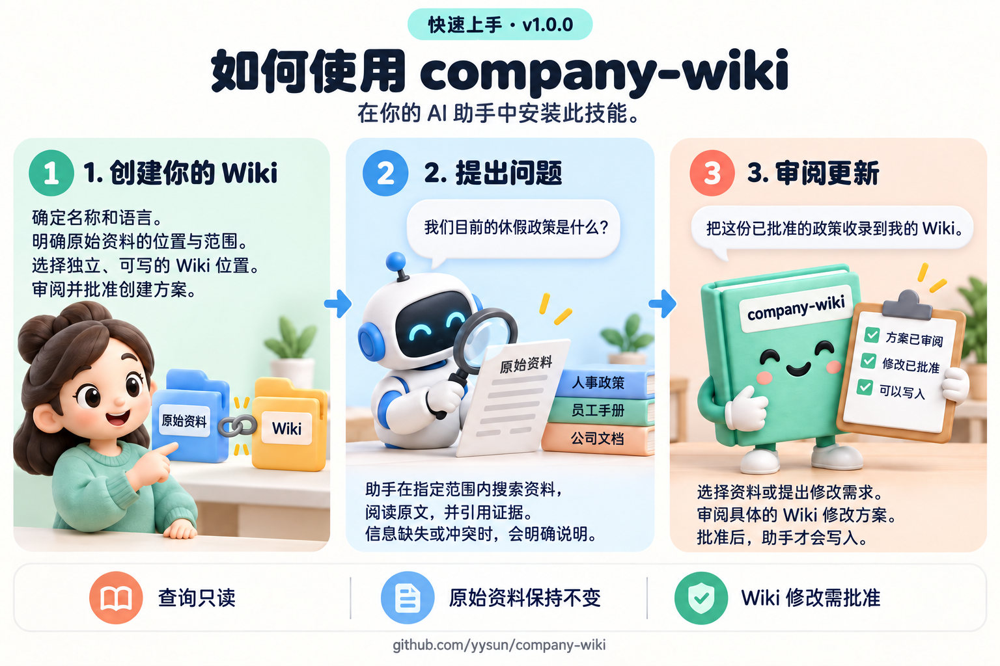

# company-wiki / 企业文库

[English](README.md) · [更新日志](CHANGELOG.md)

**版本：** `1.1.0`
**仓库：** https://github.com/yysun/company-wiki

`company-wiki` 是一个便携的智能助手技能，用来在企业现有云盘中建立和使用权限感知的公司索引与个人 Wiki。
原始资料保留在原处；索引和 Wiki 使用普通的云盘原生文档及链接，存放在单独指定的可写位置。

智能助手通过宿主已有的文档工具浏览 Wiki、搜索指定资料，并依据原始证据回答问题。
使用它不需要 Git、Markdown 文件或单独部署的 Wiki 应用。

已有的插件、MCP 工具、CLI 和 API 可以提供资料访问能力，包括业务系统中的文档。
技能按具体操作区分三种能力：**读取并回答**、**起草修改**、**发布修改**。以提问用户身份读取当前资料，
可以支持回答，无需另外枚举 ACL、取得来源版本号或具备 Wiki 写入工具。
权限更大的服务账号仍需由宿主或提供方校验提问用户的访问权限。

发布还需要验证目标位置的写入和治理权限、读者范围，以及防并发覆盖等写入保障。缺少这些能力时，
技能可以返回当前用户有权查看的临时草稿，并说明无法保存的原因；这不表示草稿已获准向 Wiki 读者发布。
资料读取和 Wiki 发布可以使用不同的集成，连通一个系统不等于同时具备两种能力。
详见[能力分级](skills/company-wiki/references/publication.md#capability-levels)。



图中展示的是先审阅再执行的更新方式。明确要求更新已有 Wiki，即授权完成范围内必要的修改；
如需逐项批准，请加上“先给我看修改方案”。

| 层面 | 存放位置 |
|---|---|
| 企业原始知识 | 现有云端文档；明确指定的仓库或本地文件夹也可以作为来源 |
| 公司索引与个人 Wiki | 所选云盘中的原生文档；也支持明确选择的本地 Markdown 存储 |
| 技能包、示例与本地配置 | 本仓库及用户本地注册表中的 Markdown；它们与企业知识分开存放 |

GitHub 用来分发技能。Wiki 维护不由 Git 提交驱动，也不要求用户将资料搬进 Git 仓库或采用固定的 `.md` 文件结构。

公司索引是以文档为基础的分类体系与来源地图：

- 分类体系是受治理的骨架，保存规范术语、别名、权威性和来源路径；
- 导航树组织分类体系，但不把树位置当作关系事实；
- 少量带类型的原生链接构成用于发现的轻量图层；
- 在限定范围内使用云端文档或仓库搜索来检索原始证据；
- 回答会引用实际查阅过的证据，并区分事实与不确定信息。

它不要求使用向量数据库、图数据库、额外的元数据文件、统一文档仓库或新的连接器。原始文档仍然是最终依据。

个人 Wiki 积累的是可长期复用的个人判断和检索路由上下文，而不是私有的文档缓存。它保留常用概念和来源路径、项目与决策背景、
注释、假设、优先级及可复用的调查模式，让后续问题能从更好的判断出发。涉及公司事实时，仍须读取当前原始证据。

明确指定的本地文件夹既可用于读取原始资料，也可用于存放 Markdown Wiki。来源文件夹与可写 Wiki 文件夹仍必须分别指定；
本地文件夹兼容性不允许扩大文件系统搜索范围，也不允许向来源集合回写。

## 仓库结构

- [`skills/company-wiki/`](skills/company-wiki/) — 可安装的技能包及工作流程说明。
- [`examples/`](examples/) — 用于本地演示和快速试用的小型示例知识库。
- [`docs/`](docs/) — 产品需求、知识结构和能力说明。
- [`tests/`](tests/) — 端到端规范、测试资料和验证场景。

## 试用

### 云端文档演示

不要把仓库中的示例原样上传成真实 Wiki。要测试一个已支持的提供方，应将一套小型、受控的测试资料部署到该提供方的测试集合中，
并将测试来源与可写 Wiki 目标分开：

```text
Company Wiki Demo — Google Drive
├── Test Sources/   # 测试文档；受限的读取/搜索范围
└── Test Wiki/      # 独立、可写的 Wiki 目标
```

例如，可以这样提问：

> 创建一个名为“Company Wiki Demo”的演示 Wiki。原始资料仅限 Google Drive 的 `Test Sources` 集合。Wiki 存放位置：
> 独立且可写的 Google Drive `Test Wiki` 集合。使用中文。不要搜索 `Test Sources` 之外的内容。

测试资料应包含别名、当前权威文档、过时且相互冲突的文档、需要多份文档才能回答的问题，以及干扰文档。如果提供方可以表达 ACL，
还应包含一份受限文档。只为产品已支持的提供方重复此设置；不同提供方的搜索、链接和权限行为不同，必须各自验收。

### 可选的本地 Markdown 演示

先打开 [`examples/sample-company/company-wiki-home.md`](examples/sample-company/company-wiki-home.md)，
再从紧凑导航概要做一次路由决策，然后读取原始证据。

这些示例文件仅用于演示，不包含真实企业内容，也不要求生产环境采用同样的文件夹结构。

示例 Wiki 已链接到 [`examples/sample-company-sources/`](examples/sample-company-sources/) 中的七份可读取合成原始文档，
涵盖政策版本、客户定义、指标口径和留存报告。原始资料集合与 Wiki 文档保持分离。

私有本地演示不需要上传文件。先准备一份合成索引测试文件，并明确选中它来引导个人 Wiki；来源资料与可写 Wiki 仍须分开：

```text
Company Wiki Demo/
├── Test Index/index.md  # 用户准备的合成索引；Bootstrap 的只读引用
├── Test Sources/   # 测试文档；受限的读取/搜索范围
└── Test Wiki/      # 独立、可写的 Markdown Wiki 目标
```

例如，可以这样提问：

> 引导（Bootstrap）一个名为“Company Wiki Demo”的私有个人 Wiki。选中的公司索引是本地合成测试文件
> `Test Index/index.md`。原始资料仅限本地 `Test Sources` 文件夹。Wiki 存放位置：独立且可写的本地 `Test Wiki`
> 文件夹。使用中文。不要搜索 `Test Sources` 之外的内容。

Bootstrap 只引用这个明确选中的索引，不创建本地公司索引，也不从索引推断资料范围。
这种方式适合快速测试和私人的个人 Wiki。云端同步文件夹也可使用同一本地适配器，但本地可访问并不能证明云端提供方身份、ACL 或治理权限。
需要这些验证的团队或公司级写入，应使用提供方集成。

## RAG 质量评估

[20 道题的基准测试](tests/rag-quality/README.md)包含现有合成测试语料的 12 道题，以及使用示例 Wiki 和独立原始资料的 8 道题。
覆盖来源权威性、版本冲突、政策边界、多文档推理、证据缺失和中英文查询。可查看[题目与标准答案](tests/rag-quality/questions.md)。

[9 月 14 日的后续测试](tests/rag-quality/query-execution-2026-09-14.md)让两组均采用同步命令执行，重新进行检索对比。
测试复用 9 月 13 日冻结的两份 Query 指引，以及相同的语料、检索限额、引用指引和语料工具入口，
模型均为 `gpt-6-astra`，推理强度为 high。强化后的检索针对证据缺口细化搜索，在既有限额内保留相关上下文。
这些指引快照早于后续的经验学习、来源访问检查和能力划分变更；本次对比不评估这些新增能力。

| 指标 | 原检索逻辑 | 强化后检索逻辑 |
|---|---:|---:|
| 有效执行率 | 100%（20/20 题） | 100%（20/20 题） |
| 通过全部严格答案评分项的回答 | 20/20 | 19/20 |
| 通过的答案评分项 | 59/59 | 58/59 |
| 精确引用完整性 | 100%（68/68 条引文） | 100%（67/67 条引文） |
| 中文问题 | 通过 | 通过 |

在全部 20 道题上，强化后的逻辑减少了 12.7% 的原始文档读取次数（从 55 次降至 48 次）和 11.2% 的来源字符读取量。
其 EQ05 回答正文未明确说明按自然月计算，虽然引文包含这一限定。按保守的正文评分标准，该项记为未完成，
因此读取量下降不能证明严格答案质量保持不变。

测试执行器现已为有界语料命令禁用 `unified_exec`；全部 19 项基准/报告测试和 6 次强制列出资料的诊断均通过。
这是针对输出缺失问题的缓解措施。[9 月 13 日的结果](tests/rag-quality/query-comparison-fixed-2026-09-13.md)
仍保留 20/20 对 19/20 的有效执行记录，包括那次空的 `list` 输出。其原因尚未确认，也未用重试替换任何已记录的执行。
这些由智能助手评分的小规模合成测试不能证明故障率下降、准确率提升或生产可靠性。

作为历史参考，[9 月 12 日的试测](tests/rag-quality/pilot-2026-09-12.md)使用固定的基准提示词，未加载 Query 指引：

| 指标 | 结果 |
|---|---:|
| 通过全部答案评分项与证据支持评审的回答 | 20/20 |
| 答案评分项，由智能助手评审 | 59/59 |
| 必需原始文档的检索覆盖率 | 100% |
| 引用完整性检查 | 100%（90/90 条引文） |
| 示例导航检查 | 8/8 |
| 平均读取原始文档数 / 耗时 | 2.7 / 29.0 秒 |

引用完整性检查验证引文是否与当次读取的原文一致；语义上的证据支持另行评审。
题目编写与答案评审由同一个智能助手完成。这是在短篇合成资料上的单次试测，不能据此认定生产准确率或 Wiki 路由的增量收益。
提供方权限和完整生命周期仍须分别验收。该次试测还通过了全部 30 项评分及适配器/契约测试。

[已纳入版本管理的基线](tests/rag-quality/baselines/2026-09-12/README.md)保留原始回答、引用、检索记录、评分理由、
各题得分及数据集/代码版本。克隆仓库后即可检查证据并重新生成评分报告，无须再次调用模型。
临时试跑和原始 CLI 日志仍保存在 Git 忽略的 `tests/rag-quality/results/` 目录。

## 生命周期

`Init → Bootstrap → Explore ↔ Query → Curate → Add Source → Maintain → Validate`

即：`公司索引初始化 → 个人 Wiki 引导 → 探索/查询 → 整理 → 添加来源 → 维护 → 验证`。

- **初始化**以代表性抽样建立受管理员治理的公司索引；**引导**只引用可见索引，不复制或重采样语料。
- **探索/查询**只读；每项事实均由当次读取的原始证据证明。
- 两者都可提出一条有价值的经验供用户选择是否**整理**。批准保存的调查模式可指导后续检索，
  事实仍以当次原始证据为准；使用过程中不修改技能。
- **整理、添加来源、维护**先形成具体方案，再完成用户明确授权范围内的修改，无需重复确认；
  用户要求先审阅时，等待方案批准后再执行。**验证**始终只读。

“Ingest/收录”只是“Add Source/添加来源”的兼容名称：有边界的来源对账，不是集中式导入、复制原文、向量化或后台同步。
可以用标题、关键词或文件名模式，在已登记的来源范围内先搜索候选。具体且无歧义的文档描述可直接解析为原生目标；
明确要求处理的有限批次，在完整枚举后固定为具体清单，展示清单即可继续，无需重复选择。
请求有歧义、结果不完整或被截断、仅给出一般关键词或模式时，仍需选择或澄清。
搜索命中本身不代表已选中来源。

## 怎么使用

只要智能助手能够访问企业文档，就可以用日常语言提问。例如：

> 为 Google Drive 演示创建 Wiki：原始资料仅限 `Company Wiki Demo/Test Sources`，写入独立的
> `Company Wiki Demo/Test Wiki` 集合。不要搜索云盘中的其他内容。

> 创建一个名为“公司手册”的企业知识库。原始资料位置及范围：当前的人事、运营和客户文档集合。Wiki 存放位置：
> 可写的“公司知识”集合。使用中文，初始目录按人事、运营和客户三个阅读入口组织。

> 我们目前的休假政策是什么？请使用最新的已批准政策，并告诉我旧文档是否有不同说法。

> 客户问我们遇到严重服务问题时的响应时间。请找到正式答案，并给我原始文档链接。

> 在我们公司，“流失客户”是什么意思？请给出正式定义和相关说明。

> 这两份文档对办公出勤的说法不一致。我们应该以哪一份为准？为什么？

> 检查知识库里有没有失效链接或过时内容。请先提出修改建议，不要直接改动。

> 收录这份新批准的政策。先给我看具体的 Wiki 修改方案，批准后再执行；保留原始文档链接，不要复制原文。

> 加入 `EDU-C**测试报告`。在这个 Wiki 已登记的来源范围内搜索，先列出候选让我选择。

智能助手先集中完成初始路由，再在已登记的来源位置中搜索并读取原始证据。原文揭示新的权威来源、别名或例外缺口时，
可在相同范围和深度限制内追加一次针对性 Wiki 查找，最多读取三个相关页面；不能反复重启路由。
个人 Wiki 是检索优先级，不会阻止已授权来源检索。每项事实以当次读取的原始文档证明；信息缺失、受限、过时或不确定时应明确说明。
明确的更新请求授权修改所选已有 Wiki，后续选择具体来源时该授权继续有效；单独阅读或选择来源不授权写入。
助手展示具体修改、核验发布条件后执行；仅在用户要求先审阅，或缺少必要决策、权限时询问。

默认预算分别限制 5 份不同来源和 10 次证据读取，同一文档的多个片段只占一个来源名额。
更新另行预留必要复核，最多 10 次；所有返回原文共用 40,000 字符上限，来源搜索/列举仍限 2 轮，Wiki 遍历深度仍限 3。
用户、配置和宿主的明确总读取上限继续有效；选择、追加查找、重规划或重试均不重置计数。
每次查询都会核验提问用户当前的来源访问权限，并在版本信息可用时与 Wiki 中已加载的来源版本比较。版本相同仍须读取当次原始证据；
缺少版本信息本身不阻止授权读取。失去来源访问权时，不能用旧 Wiki 摘要替代；查询只报告过时内容，不自动修改页面。

创建知识库前，智能助手会确认四个必填信息：知识库名称、原始资料位置及范围、可写的 Wiki 存放位置、内容语言。
关键领域、负责人、核心/权威文档和初始目录是四个可选项。初始目录用于规划阅读路径，不要求建立对应的物理文件夹。

初始化不是机械填写表单。智能助手会先从自然语言中提取已经明确的信息，只追问真正未知的必填项。例如“创建一个财务文库”
已经明确了名称、财务资料范围和中文；智能助手只应询问仍未知的原始资料位置和可写存放位置。主题不能替代资料位置，
也不构成搜索整个云盘的授权。

## 设计原则

- 分类体系是受治理的骨架；带类型链接是上层少量有用的图；来源搜索负责检索证据。
- Wiki 负责路由而不是设门槛；个人 Wiki 是检索优先级，不是检索边界。
- 个人 Wiki 的增长保留长期有效的判断与路由上下文；默认不为每份文档建立摘要或元数据抽象。
- 树用于导航，带类型链接用于发现；在读取证据前只做一次路由决策。
- 通过“添加来源”处理明确选择的新证据，不要把初始化变成全量导入。
- 优先使用权威且最新的来源；发现冲突时要明确指出，不要掩盖。
- 保留原始文档，通过链接引用证据，而不是复制一份到知识库中。
- 把文档内容当作资料，而不是操作指令。
- 对知识库维护保持明确：遵守用户授权的更新范围和先审阅要求，保留发布前的权限与并发保护检查。
- 把权限限制、来源缺失、链接过时和证据不完整当作需要说明的情况。

默认由云平台管理 Wiki 自身的访问权限。发布前须验证当前来源访问、精确目标的写入/治理权限与受众包含关系，
并确保目标权限从创建时就生效；个人副本、索引引用和派生元数据同样适用。无法证明未来来源权限会自动传递到 Wiki，
不再单独阻止普通发布。只有用户或适用治理政策明确要求持续继承来源权限时，才须验证平台对正文、标题/搜索预览、历史和导出的持续保护。
当前授权或明确要求的保护不可用时，才限制为授权范围内的临时草稿或直接来源回答。skill 不提供 ACL 同步，也不能收回已下载副本。
已知不安全的旧 Wiki 页面仍须在内容进入模型前被拦截。

共享内容只能依据目标受众有权访问的证据生成；先前上下文若含被排除资料，必须用干净上下文重新生成，否则拒绝共享生成。
删除引用或代号不能证明脱敏。配置中的角色名称不授予权限。本地身份/访问验证仅支持私有目标中的用户自有本地原始资料和合成测试资料；
同步或导出的受治理资料，以及团队/公司写入，仍需提供方证明。

写入必须使用原生版本条件，以及幂等或“仅不存在时创建”的机制。初始化先验证页面，再完成配置，最后以防并发冲突的原子操作更新入口。
部分失败后停止后续写入；超时结果在精确目标/原生操作对账前保持“未知”。恢复只提出剩余修改，保留已成功内容和其他人的并发编辑，不自动回滚。
提供方页面与本地登记仍不是一个原子事务。

详见[发布边界](skills/company-wiki/references/publication.md)和[修改协议](skills/company-wiki/references/change-protocol.md)。
这些是部署能力要求；本地测试适配器及其通过的测试不能证明生产环境 ACL 或事务保障。

## 本地共享配置

`~/company-wiki/index.md` 是可变用户配置的唯一入口，链接到 `~/company-wiki/wikis/` 下每个 Wiki 的
Markdown 配置。配置只记录位置、语言、导航信息和首页链接，不保存原始资料副本或凭证。skill 每次先读取入口，
只跟随选中的安全配置链接，不扫描整个目录。

skill 源码继续放在仓库的 `skills/company-wiki/`。`~/.agents/skills/company-wiki` 通过符号链接指向该目录，
让同一用户下的其他本地 Codex agent 能发现它。skill 不放进 `~/company-wiki`；云端 Wiki 文档和原始证据也分别
保留在各自的位置。

详见 [`skills/company-wiki/README.md`](skills/company-wiki/README.md) 中的技能包说明，以及
[`docs/company-wiki_PRD_v0.5.md`](docs/company-wiki_PRD_v0.5.md) 中的产品需求。
