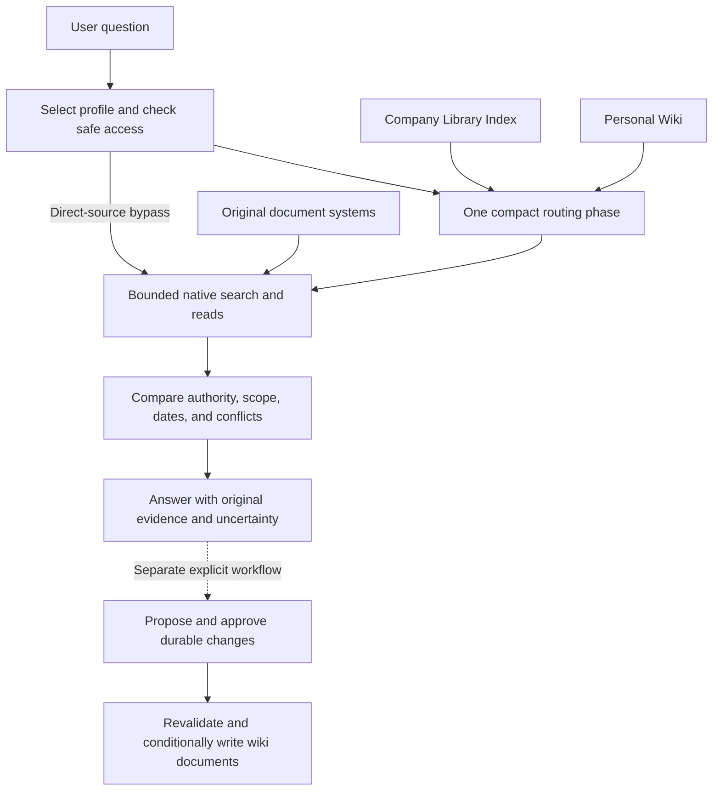

# Company Wiki: A Document-Native Semantic Routing Layer for Enterprise Question Answering

**Technical manuscript — September 12, 2026**

## Abstract

Enterprise question answering requires more than finding text similar to a question. An assistant must interpret local terminology, distinguish current authority from obsolete or provisional material, combine evidence across organizational boundaries, and preserve the access restrictions of every contributing source. We present **Company Wiki**, a portable agent skill that places a small, curated semantic routing layer over existing document collections. A shared Company Library Index records canonical concepts, aliases, authority cues, source routes, and selected typed relationships. A user-controlled Personal Wiki accumulates reusable investigation context and judgment. Neither layer replaces original evidence: each factual answer requires source material read during the current operation. The architecture separates one bounded routing phase from iterative source retrieval, permits direct search when the map is incomplete, and makes durable knowledge changes explicit and reviewable. We describe a publication contract for derived content and a conditional-write protocol for non-atomic document systems. An available snapshot of a synthetic component pilot contains ten completed queries: all satisfy retrieval bounds and required-source-open recall, and eight semantically reviewed answers satisfy their full rubrics. These preliminary observations assess direct-source answer behavior, not the incremental value of wiki routing, production access control, or lifecycle reliability. We provide a controlled evaluation design for those unresolved claims. The contribution is a document-native architecture and operational contract for separating organizational meaning, current evidence, and personal working knowledge without requiring a new corpus index.

**Keywords:** retrieval-augmented generation; enterprise knowledge; semantic routing; personal knowledge management; provenance; access control; agent skills.

## 1. Introduction

A company can possess the right document and still produce the wrong answer. An employee asks for the current attendance requirement, and search returns an old handbook alongside an approved policy and next year's draft. A customer-facing team asks about a critical service commitment, while the governing agreement uses a severity classification. A quarterly review names a migration as a possible explanation for declining retention, and an assistant reports it as an established cause. These failures concern terminology, authority, scope, and reasoning as well as retrieval relevance.

The product problem is therefore not simply how to expose more documents to a language model. It is how to preserve the organizational knowledge needed to select and interpret evidence without creating another repository of facts that must be synchronized with the originals. Copying each source into a wiki can simplify navigation, but it creates another surface on which content, permissions, and authority can become stale. Searching from scratch avoids that particular duplication while repeatedly discarding useful knowledge about definitions, source ownership, and previous investigations.

Company Wiki separates these responsibilities. The **Company Library Index** provides a governed map of shared concepts and evidence routes. The **Personal Wiki** retains the user's reusable context, including priorities, annotations, decision context, and investigation patterns. Existing document systems supply the evidence, versions, and access controls. The language-model host coordinates these components through an installable skill and the tools it already exposes.

The central hypothesis is that a relatively small amount of curated organizational meaning can improve evidence selection and interpretation across many questions. The map does not need to represent every document. It must help the assistant recognize the right concepts, identify the relevant authority, and investigate beyond the map when coverage is missing. Its utility depends on the quality of those decisions, rather than on the number of pages accumulated.

This manuscript makes three contributions:

1. A layered, document-native representation that separates shared semantics, personal working knowledge, and original evidence.
2. An operational protocol for bounded retrieval, deliberate curation, audience-safe derivation, and conflict-protected document updates.
3. An explicit separation between available component evidence and the controlled experiments needed to establish routing benefit, personalization value, and deployment safety.

The current artifact is an agent skill, workflow references, examples, and test infrastructure. It is not a newly trained retrieval model or a production document service. Formal expressions below summarize design obligations; they are not proofs that a language model or provider satisfies them.

## 2. Related Work

### 2.1. Retrieval-augmented generation

Lewis et al. combine parametric generation with a dense index of Wikipedia passages, establishing a model architecture in which retrieved external memory conditions the answer [1]. Company Wiki operates at a different layer: it guides an existing agent's selection and interpretation of sources. It neither trains a retriever nor specifies the internal index used by a source provider. Its lack of a required vector database is a deployment choice, not evidence that dense retrieval is unnecessary or inferior. [Retrieval-Augmented Generation for Knowledge-Intensive NLP Tasks](https://arxiv.org/abs/2005.11401).

### 2.2. Graph and hierarchical retrieval

GraphRAG derives an entity graph and community summaries from source documents to support questions requiring a global view of a corpus [2]. RAPTOR constructs a hierarchy by recursively embedding, clustering, and summarizing text, then retrieves across levels of abstraction [3]. Company Wiki instead maintains a selective, curated taxonomy with a small typed-link overlay. Its tree organizes navigation; it is not a recursively generated summary index. This choice avoids requiring corpus-wide preprocessing, while leaving global synthesis and long-tail recall dependent on the underlying search tools and retrieval budget. No performance comparison with either method is claimed. [GraphRAG](https://arxiv.org/abs/2404.16130), [RAPTOR](https://arxiv.org/abs/2401.18059).

### 2.3. Knowledge organization and provenance

SKOS provides a model for concepts, lexical labels, hierarchies, and associative relationships [4]. These distinctions motivate the use of canonical concepts, aliases, and explicit links in a lightweight wiki. Company Wiki uses ordinary documents and native links; it does not claim SKOS conformance or require an RDF store. PROV-O represents provenance through entities, activities, agents, and derivation relationships [5]. The corresponding concern here is preserving the original source, version, checked date, and origin near a derived claim. Readable provenance supports inspection, but is not itself an authorization mechanism. [SKOS Reference](https://www.w3.org/TR/skos-reference/), [PROV-O](https://www.w3.org/TR/prov-o/).

### 2.4. Tool-using agents

ReAct interleaves reasoning with actions that obtain information from external environments [6]. Company Wiki similarly supports investigation through tool use, but adds a particular routing constraint: load the permitted compact wiki context, make one routing decision, and then investigate original sources without returning to wiki route selection. Source retrieval can remain iterative within that phase. The restriction makes routing cost and dependence on the wiki more observable, although its effect on difficult questions requires measurement. [ReAct](https://arxiv.org/abs/2210.03629).

The proposed contribution lies in the combination of document-native knowledge organization, personal context, explicit evidence authority, and lifecycle boundaries. It is not a claim that taxonomies, provenance, or agentic retrieval are individually new.

## 3. Problem Formulation

Let $D$ denote the available original documents, $u$ a requesting user, $t$ the time of an operation, and $q$ a question. A selected configuration profile declares a bounded set of source locations $B$ and a separate wiki destination $W$. Let $A_u(t)$ be the source material the host can establish that the user may currently access. The eligible evidence space is

$$
D_{u,B}(t) = D \cap B \cap A_u(t).
$$

The notation includes document metadata when that metadata is access-sensitive. A readable title, alias, or link is already a disclosure; authorization cannot be deferred until the document body is opened.

Let $K_C$ denote the safely readable shared index and $K_u$ the safely readable Personal Wiki. The agent constructs a routing plan

$$
\pi = R(q, K_C, K_u),
$$

then uses host-provided search and read tools to obtain an evidence set $E$ within $D_{u,B}(t)$. The route may specify aliases, likely source areas, authority types, typed links, and an investigation pattern. It may also select direct search with no wiki reads.

Two constraints are essential. First, the eligible evidence space comes from explicit source bounds and access checks, not from wiki coverage. A relevant document does not become ineligible merely because it lacks a node in the map. Second, the wiki supplies retrieval context rather than factual sufficiency. Each factual assertion in an answer must be supported by original evidence read in the current operation, with interpretation and unresolved conflict made explicit.

Evidence authority is question-dependent. Approval status, effective date, applicability, version, and explicit supersession must be compared together. A newer draft does not automatically outrank an older approved policy. A general policy does not necessarily settle a question governed by a more specific agreement. Where the retrieved evidence does not establish precedence, the answer must preserve the uncertainty.

The design aims to improve answer quality while controlling search effort and maintenance burden. These objectives can conflict: additional curation may improve routing but increase upkeep; tighter retrieval bounds improve predictability but can prevent complete answers. The current implementation supplies operating defaults rather than a learned optimizer for these tradeoffs.

## 4. Architecture and Representation

### 4.1. Three knowledge scopes over existing sources

The architecture distinguishes a Company Library Index governed by a company administrator, optional Team Wikis governed by designated curators, and user-controlled Personal Wikis. Team scope is representable in the current model but does not have a separate V1 workflow. Lower scopes reference shared knowledge instead of cloning it.



*Figure 1. Query execution and durable knowledge growth are separate operations. Access checks apply before protected routing content or source evidence enters the model; every durable write additionally requires the publication contract in Section 6.*

The shared index answers questions such as which concept a term denotes, where the governing definition lives, and which source type should be consulted. Personal knowledge answers a different set of questions: why a topic matters to this user, what has already been investigated, which hypotheses remain open, and which evidence routes have proved useful. Personal context can change the investigation priority, but cannot make a company fact true or expand access rights.

### 4.2. Taxonomy, navigation tree, and typed links

A scope has a readable home or map. A canonical node records a title, aliases, a concise scope, a source entry point, and a primary parent. The primary-parent structure supplies a stable navigation route. Tree placement alone makes no claim of ownership, dependency, causation, or policy authority.

Selected typed links express relationships that placement cannot convey. Examples include `governed_by`, `depends_on`, `supersedes`, and `related_to`. Such links must be reviewable and evidence-backed when they assert organizational facts. A proposed relationship remains an interpretation rather than becoming authoritative through repetition in the wiki.

This distinction prevents two common modeling errors. A folder hierarchy is not automatically a business ontology, and an untyped hyperlink does not explain why two concepts are connected. The design uses only as much structure as recurring questions require. It does not attempt to extract a comprehensive enterprise graph.

### 4.3. Problem patterns and personal knowledge

A problem pattern records what an investigation needs, rather than prescribing its answer. For example, explaining a metric change requires a definition, population and time boundaries, comparable observations, a segment breakdown, relevant events, and plausible alternatives. A project-status question requires evidence of delivery, not only a charter stating intent.

Personal curation retains these reusable patterns alongside annotations, project context, hypotheses, and priorities. The home exposes controls for pinned, temporary, personally canonical, and do-not-curate topics. “Personally canonical” means a preferred personal reference; it does not confer company policy authority.

Growth is selective. Reuse, explicit user intent, project importance, or structural value can justify making a discovery durable. An isolated question does not automatically create a page. Company facts in personal content remain subject to current original-source verification when used.

### 4.4. Storage and configuration

Wiki artifacts are ordinary native cloud documents with links; explicitly selected local storage also supports Markdown. Markdown is used for the repository's examples and local configuration, but it is not a required cloud document format. Git is neither a runtime dependency nor a wiki maintenance mechanism. No front matter, per-document metadata sidecar, graph database, embedding store, or background synchronization process is required. Existing source providers may use their own indexes; Company Wiki does not replace those internals.

Mutable local configuration has a single entry point, `~/company-wiki/index.md`, linking to contained Markdown profiles under `wikis/`. Profiles record locators and navigation metadata, not credentials or source copies. Each operation selects one profile and follows only the specifically allowed profile edges, such as a Personal profile's named Company Index reference. Registry text is configuration data, not evidence or instructions, and role labels cannot grant capability.

Initialization requires an explicitly supplied original-material location and a separately supplied writable wiki destination. A topic or wiki name cannot supply either boundary. Local folders are supported, but local file access does not establish the identity, sharing rules, or revocation behavior of a cloud provider from which material was synchronized or exported.

## 5. Retrieval and Answer Protocol

### 5.1. One routing phase, bounded investigation

For an ordinary routed query, the agent loads the selected Personal home and its named, visible Company Index home, plus at most three declared routing pages per scope. It uses that compact context to choose concepts, aliases, relevant typed links, source routes, and direct searches together. It does not repeatedly navigate from home to guide to detail while reconsidering the route after each evidence read.

The default contract limits wiki traversal depth to three, source listing/search rounds to two, original document opens to five, and retrieved original-source content to 40,000 Unicode characters. The compact-context limits and source limits apply to different parts of the operation. Exhausting a limit requires reporting what remains unresolved and obtaining authorization before expanding it.

These are effort bounds, not completeness guarantees. A cross-domain question may require more than five documents. Within the available budget, the agent should prefer a small, diverse evidence set over several nearly identical search results. Direct source search remains available when the question contains an exact identifier, concerns recent or unrepresented material, or has no useful or safely readable wiki route.

### 5.2. Operational sketch

```text
Algorithm 1: Bounded evidence-grounded query

Input: question q, authenticated requester u, selected profile p
Output: supported answer, qualified partial answer, or safe refusal

1. Resolve p through the registry contract; establish its source bounds.
2. Check disclosure safety before loading derived routing material.
3. Choose either:
     a. bounded compact wiki context and one routing plan; or
     b. direct source search within independently registered bounds.
4. Search and read eligible originals within the remaining budget.
5. Compare applicability, authority, status, dates, and supersession.
6. If evidence is insufficient and budget remains, refine source retrieval.
   Do not reopen the wiki routing phase.
7. Answer using originals read in this operation. Cite factual claims;
   label inference, conflict, missing evidence, and exhausted limits.
8. Make no wiki, registry, or original-source changes.
```

Explore uses the same read-only discipline to investigate a topic and may suggest later curation. Query produces an answer. Neither turns a useful result into a durable update implicitly.

### 5.3. Example: interpreting a retention change

The synthetic service-company corpus contains a canonical definition of a lapsed account, a quarterly account review, and a project charter. The definition uses at least 60 days without an active service contract. The review records an increase from 41 to 58 lapsed accounts, with 14 additional accounts in hospitality. The charter identifies Kestrel as a billing-platform project. The review presents migration-related invoicing delays and a price increase as possible contributors, without confirming either cause.

A useful answer must distinguish four things: the governing definition, the observed change, the project identity, and the causal uncertainty. It may calculate a net increase of 17 and the segment contribution. It cannot conclude that the migration caused the increase merely because the documents connect the subjects. These facts and the observed pilot answer are available in the [FQ08 result](../tests/rag-quality/results/2026-09-12-pilot/FQ08/result.json).

This example illustrates the intended role of a problem pattern: ensure that the investigation asks the right questions. It does not establish that wiki routing was responsible for the result; the recorded fixture case used direct source discovery.

## 6. Knowledge Lifecycle and Publication Boundaries

### 6.1. Explicit growth and maintenance

The lifecycle is `Init → Bootstrap → Explore ↔ Query → Curate → Add Source → Maintain → Validate`. This is a family of operations, not a mandatory sequence for every request.

| Operation | Purpose | Durable effect |
|---|---|---|
| Init | Build a small shared index through bounded representative sampling | Approved Company Index pages and registration |
| Bootstrap | Establish a minimal Personal Wiki referencing a selected index | Approved personal home and registration |
| Explore / Query | Investigate or answer from current original evidence | None |
| Curate | Retain reusable knowledge or promote a selected contribution | Approved changes in an authorized scope |
| Add Source | Reconcile an exact source or explicitly bounded batch | Smallest approved coherent wiki update |
| Maintain | Repair, refresh, merge, or restructure existing wiki knowledge | Approved corrections preserving concurrent work |
| Validate | Inspect structure, provenance, freshness, and safe visibility | Read-only findings |

Init does not attempt an exhaustive import. Bootstrap does not resample the corpus or copy index children: it creates a minimal personal home with a protected reference to the explicitly selected index. Source bounds must be supplied independently and cannot be inferred from the index's contents.

Add Source is deliberate reconciliation. Its compatibility alias, Ingest, does not denote an ETL pipeline or a background indexing stage. It requires exact documents or an explicitly bounded batch and proposes only material changes. An unchanged source does not require a processing receipt or duplicate node. Original sources remain unchanged across all workflows.

### 6.2. Read authority and publication authority

The ability to read evidence does not establish the right to republish its meaning. Let $L(x)$ be the transitive set of evidence contributing to a proposed artifact $x$, including its title, aliases, links, relationships, and provenance. Let $\operatorname{Aud}(z,t)$ be the authorized audience of resource $z$ at time $t$. A necessary publication condition is

$$
\operatorname{Aud}(x,t)
\subseteq
\bigcap_{d \in L(x)} \operatorname{Aud}(d,t).
$$

The condition concerns actual derivation, not only the final citation list. Removing a restricted citation cannot make a conclusion safe when that conclusion was generated using restricted evidence. Shared generation must start from destination-authorized inputs. If earlier context contains excluded evidence, the host must provide clean regeneration with authorized inputs or decline that generation.

For provider-governed evidence, a current audience comparison is insufficient. Continuing containment must be enforced by the provider from creation onward, including after source revocation, destination widening, group membership changes, and inheritance changes. Relevant exposure surfaces include content, titles, search previews, history, and export endpoints. Identity, exact-scope write/govern authority, audience containment, and continuing protection are distinct checks; unavailable proof blocks publication.

This is a demanding deployment requirement. The skill provides no ACL synchronization service and cannot recall downloaded or previously disclosed copies. When a host cannot establish the required protection, the permitted result is an authorized transient draft or direct-source answer, not a persistent governed copy. The narrow local exception covers user-owned local originals or synthetic fixtures in a verified private destination. Synced or exported governed material and Team/Company writes do not qualify.

### 6.3. Protecting reads and updates

Unsafe derived material must be gated before its bytes enter the model. A legacy wiki page can leak through its title or an alias even when the underlying original is inaccessible. If safe access cannot be established through protected metadata or a provider-enforced read boundary, the agent skips that page and uses an independently registered source route when available. An instruction to ignore restricted content after loading it is not an access boundary.

Durable changes follow a separate protocol. A concrete proposal identifies targets, changes, evidence versions, destination scope, audience checks, write order, and operation semantics. Approval binds that particular intent. Immediately before applying it, the agent rechecks identity, authorization, evidence, targets, versions, and continuing protection. Material drift invalidates the approved plan.

Updates require provider-enforced version conditions or an equivalent verified exclusive-write mechanism. Creates require conditional creation or native idempotency with reconcilable outcomes. Rereading followed by an unguarded write leaves a concurrency gap and is insufficient. Dependencies are created and verified before links to them are exposed, while each intermediate artifact must independently satisfy publication safety.

A failed response is not necessarily a failed write. A timeout may follow a committed operation. The protocol stops subsequent writes and reconciles exact approved targets or native operation keys, distinguishing confirmed success, confirmed failure, unknown outcome, and unattempted work. Recovery preserves successful and concurrent edits; it does not automatically roll back. Registry updates and provider writes are not assumed to form one atomic transaction. Without sufficient native operation identity after a crash, recovery may remain unresolved.

## 7. Implementation Status

The repository implements the product primarily as a portable instruction package in `skills/company-wiki/`, supported by focused lifecycle references. The package delegates search, reads, authentication, and conditional writes to the host and its existing provider tools. There is no independent production service in this repository that can enforce those provider capabilities on its own.

The shipped examples demonstrate flat linked documents and separate synthetic originals. A deterministic local lifecycle adapter provides bounded logical targets and fault controls. Static contract tests check that required workflow rules remain present; adapter tests exercise local behavior. These mechanisms support development and regression detection, but a successful static assertion or simulated permission failure does not establish production access enforcement.

A separate Python benchmark runs actual Codex sessions against a read-only synthetic corpus tool. Its JSON datasets, traces, hashes, and evaluator records are test infrastructure. They are not runtime wiki sidecars, source indexes, or a new requirement on user document collections.

The main implementation distinction is thus between **specified obligations**, **locally exercised behavior**, and **provider capabilities requiring deployment evidence**. The article treats them separately throughout.

## 8. Preliminary Component Evaluation

### 8.1. Dataset and procedure

The [synthetic RAG benchmark](../tests/rag-quality/README.md) defines 20 development questions over two bounded corpora. Twelve fixture questions cover policy authority, superseded and draft documents, terminology mismatches, ownership, approval thresholds, conflicting definitions, multi-source diagnosis, missing evidence, false premises, project intent versus completion, and a Chinese query over English sources. Eight example questions use the shipped wiki and seven synthetic originals for policy and customer-metric tasks.

Each evaluated session receives one question in a fresh ephemeral context. The corpus tool supports directory listing, regular-expression search over originals, and full document reads. Gold evidence identifiers and atomic answer criteria are withheld from the evaluated process. The configured session uses `gpt-6-astra`, high reasoning effort, and `codex-cli 0.154.0`, as recorded in the run manifest.

Trace checks reject observed tools or commands outside the allowed corpus invocation. Source hashes check that originals remain unchanged. These checks assess evaluation integrity; they are not an operating-system or cloud-provider security proof. Listing/search, original-read, and character budgets follow the Query contract. Example navigation additionally requires the home first, at most three further wiki reads, and no wiki reads after source search or reading starts.

### 8.2. Measures

For question $i$, let $G_i$ be the gold set of required originals and $O_i$ the originals opened. Required-source-open recall is

$$
\operatorname{Recall}_i = \frac{|G_i \cap O_i|}{|G_i|}.
$$

This measures recovery of the specified evidence, not exhaustive recall of every relevant document. Search snippets do not count as full reads. Citation integrity checks that a quoted span occurs exactly in an original read during the operation and that its identifier appears inline. It does not test whether the quote entails the associated claim.

Semantic review separately evaluates atomic answer criteria and whether the complete answer contains unsupported factual assertions. A strict answer pass requires every criterion to pass and the answer to be judged grounded. Unreviewed answers remain unscored; they are neither semantic passes nor semantic failures.

### 8.3. Recorded snapshot

Table 2 reports the saved scorecard observed at **2026-09-12 14:19 UTC**, rather than treating an in-progress run as complete. At that snapshot, FQ01–FQ10 were completed and FQ01–FQ08 had semantic reviews. FQ09 and FQ10 were completed but not semantically scored. The other ten cases were marked `not_run` in the saved scorecard. The artifact fingerprint appears in Appendix A.

| Measurement | Recorded result | Denominator or interpretation |
|---|---:|---|
| Completed cases | 10 / 20 | All completed cases use fixture direct-source discovery |
| Semantically reviewed cases | 8 / 20 | FQ01–FQ08 only |
| Strict answer pass | 8 / 8 | Reviewed answers only |
| Atomic rubric criteria satisfied | 23 / 23 | Criteria in the eight reviewed answers |
| Answers judged grounded | 8 / 8 | Agent semantic review |
| Mean required-source-open recall | 100% | Ten completed cases |
| Citation integrity | 45 / 45 | Exact quotation, observed read, and inline reference |
| Within retrieval bounds | 10 / 10 | Two discovery rounds, five original opens, 40,000 characters |
| Example navigation evaluated | 0 cases | No navigation success rate is established |
| Mean original documents opened | 2.3 | Ten completed cases |
| Mean elapsed time | 24.32 seconds | Includes CLI startup |

*Table 2. Partial component observations; the semantic and execution denominators differ. Source: the [saved pilot scorecard](../tests/rag-quality/results/2026-09-12-pilot/scores.json) and [report](../tests/rag-quality/results/2026-09-12-pilot/report.md), at the fingerprinted snapshot.*

The recorded host usage totals are 729,492 input tokens, including 509,696 cached input tokens, and 4,409 output tokens across the ten completed cases. Input usage includes host context, so it cannot be interpreted as retrieved evidence volume or compared directly with a minimal standalone RAG pipeline. No cost advantage follows from these measurements.

The reviewed responses correctly distinguish a current policy from superseded and draft alternatives, interpret a strict approval threshold, preserve competing business definitions, and avoid converting unconfirmed business explanations into established causes. These are useful observations about the tested answer contract. They do not show that the wiki improved those answers: the completed cases used direct discovery.

### 8.4. Threats to validity

The benchmark uses short synthetic documents and development questions, with one execution per case. The semantic reviewer is an agent that also authored the cases; the review is neither independent nor human-calibrated. The partial snapshot does not cover example navigation, cross-language behavior, all planned uncertainty cases, or the full lifecycle. The two corpora differ, so comparing fixture and example scores would confound routing with task and corpus differences.

Consequently, the observed perfect scores on reviewed cases support no general estimate of production accuracy, robustness, or comparative superiority. They also say nothing about live provider search relevance, revocation, publication containment, large collections, or adversarial prompt-injection resistance. These require separate experiments.

## 9. Evaluation Required to Test the Product Hypothesis

### 9.1. Paired routing and personalization experiments

A controlled comparison should hold questions, originals, model, tool access, source budgets, and answer rubrics constant while varying routing context:

| Condition | Available routing context | Main comparison |
|---|---|---|
| A | Direct LLM and native source search | Answering baseline |
| B | Company Library Index and the same source search | Incremental shared-index contribution |
| C | Personal Wiki, Company Library Index, and the same source search | Incremental personal-context contribution |

Question order should be randomized, generation repeated, and answer review blinded to the condition. Report paired differences and uncertainty for strict answer success, evidence recall, authority errors, citation entailment, reads, discovery calls, latency, and token use. Matching source budgets tests performance under equal evidence limits; an additional matched-total-cost analysis is needed because wiki context itself consumes time and tokens.

Personalization requires a longitudinal split. Build personal knowledge through authorized curation on earlier tasks, then evaluate on later held-out questions. Reusing the exact development questions would risk measuring memorized routes. Include source changes and novel topics to determine whether personal context accelerates investigation or anchors the agent to stale assumptions.

### 9.2. Ablation and coverage stress

Useful ablations remove aliases, authority cues, typed links, or problem patterns while preserving the rest of the map. They test whether a particular representation element improves an identifiable failure mode. Deliberately incomplete and stale taxonomies test the claim that the map guides retrieval without excluding unrepresented evidence. A comparison of one-phase routing with bounded re-routing would test whether the current restriction saves effort at an acceptable recall cost.

Larger and longer-document corpora should include near-duplicate policies, ambiguous names, non-text content, contradictory authority signals, and questions requiring more evidence than the default budget permits. Correctly reporting an exhausted bound should be scored separately from answering a question completely.

### 9.3. Governance and lifecycle acceptance

Provider acceptance must operate against real identities and exact test destinations. Scenarios should cover denied reads, metadata exposure, source revocation, destination widening, group changes, inherited access, historical versions, previews, and exports. Each scenario should inspect what a less-privileged principal can actually obtain. Agent statements that access is safe are not sufficient observations.

Mutation tests should inject source and target drift, concurrent edits, create collisions, timeouts after commit, partial failures, and lost operation identity. The expected outcome is bounded recovery that preserves concurrent work and reports unknown states accurately. A host unable to enforce the publication contract should be evaluated for correct refusal of durable publication, not credited with unsupported guarantees.

### 9.4. Maintenance economics

The product hypothesis is incomplete without measuring the cost of keeping the map useful. A longitudinal study should record curator effort, accepted versus rejected changes, reuse of retained knowledge, stale-route incidents, page growth, and repair time. A larger Personal Wiki is not inherently better. Routing improvements must justify additional reading and maintenance, and retirement decisions should reduce accumulated clutter without losing useful context.

## 10. Discussion and Limitations

The architecture concentrates organizational interpretation in a small, inspectable layer. This is useful when definitions, authority, and source ownership repeatedly affect decisions. It also exposes a practical weakness: curation quality becomes a dependency. Incorrect aliases or unjustified authority cues can systematically misdirect many future questions. Source rechecking limits factual reuse but does not eliminate route-selection bias.

Avoiding a new ingestion pipeline reduces required infrastructure. It also leaves recall, ranking, pagination, and supported formats to existing providers. The design offers no guarantee of fast retrieval over a large corpus or comprehensive synthesis across all documents. For questions already expressed as exact identifiers, the direct-search path may be sufficient and additional routing context may add overhead.

Human-readable documents and links make knowledge inspectable in the chosen provider's document tools, while providing weaker structural enforcement than a dedicated schema service. Broken links, inconsistent aliases, and unsupported relationships require explicit validation. Likewise, an instruction package cannot supply concurrency control, clean-context isolation, or continuing authorization that the host lacks. Unsupported capabilities constrain where durable deployment is feasible.

The strict publication contract places particular pressure on cross-provider derivations. A source provider and a destination provider may have independent permission systems with no mechanism for continuing containment. In such environments, transient answers can remain useful while persistent derived pages remain unavailable. That limitation is part of the architecture's current deployment boundary.

Finally, selective personal knowledge can preserve useful judgment or reinforce old assumptions. An annotation can outlive the situation that made it helpful. The separation of personal preference from company authority, visible uncertainty, explicit maintenance, and evaluation on changed sources are therefore central to the design. Their effectiveness remains an empirical question.

## 11. Conclusion

Company Wiki proposes a document-native semantic routing layer for enterprise question answering. Shared concepts and source routes provide organizational context; a Personal Wiki retains deliberate working knowledge; original documents supply current evidence. A bounded routing protocol, explicit curation lifecycle, and conditional publication contract keep these responsibilities distinct.

The available synthetic pilot demonstrates selected direct-source retrieval and answer behaviors under a constrained contract. It does not establish the incremental value of the wiki or production governance guarantees. The decisive next evidence is a paired evaluation on the same questions and sources, followed by longitudinal maintenance studies and provider-specific acceptance. The product succeeds if its curated map improves decisions and investigation efficiency enough to repay the effort required to keep that map accurate.

## References

1. Patrick Lewis et al. 2020. **Retrieval-Augmented Generation for Knowledge-Intensive NLP Tasks.** NeurIPS 2020. [arXiv:2005.11401](https://arxiv.org/abs/2005.11401).
2. Darren Edge et al. 2024. **From Local to Global: A Graph RAG Approach to Query-Focused Summarization.** [arXiv:2404.16130](https://arxiv.org/abs/2404.16130).
3. Parth Sarthi, Salman Abdullah, Aditi Tuli, Shubh Khanna, Anna Goldie, and Christopher D. Manning. 2024. **RAPTOR: Recursive Abstractive Processing for Tree-Organized Retrieval.** [arXiv:2401.18059](https://arxiv.org/abs/2401.18059).
4. Alistair Miles and Sean Bechhofer, editors. 2009. **SKOS Simple Knowledge Organization System Reference.** W3C Recommendation, August 18, 2009. [W3C specification](https://www.w3.org/TR/skos-reference/).
5. W3C. 2013. **PROV-O: The PROV Ontology.** W3C Recommendation, April 30, 2013. [W3C specification](https://www.w3.org/TR/prov-o/).
6. Shunyu Yao, Jeffrey Zhao, Dian Yu, Nan Du, Izhak Shafran, Karthik Narasimhan, and Yuan Cao. 2022. **ReAct: Synergizing Reasoning and Acting in Language Models.** [arXiv:2210.03629](https://arxiv.org/abs/2210.03629).

## Appendix A. Artifact Provenance and Reproducibility

This manuscript describes the repository working state inspected on September 12, 2026. The primary product sources are the [README](../README.md), [PRD v0.5](company-wiki_PRD_v0.5.md), [skill package](../skills/company-wiki/SKILL.md), and its [document format](../skills/company-wiki/references/document-format.md), [Query protocol](../skills/company-wiki/references/query.md), [publication boundary](../skills/company-wiki/references/publication.md), and [change protocol](../skills/company-wiki/references/change-protocol.md). Where conceptual diagrams in planning documents are broader, the current focused workflow references define the operation described here.

The experimental evidence comes from the [benchmark definition](../tests/rag-quality/README.md), [dataset](../tests/rag-quality/dataset.json), [runner](../tests/rag-quality/benchmark.py), and recorded run under `tests/rag-quality/results/2026-09-12-pilot/`. No new model experiment or semantic review was conducted for this article. The manuscript reports an existing partial scorecard; subsequent result files or reviews may advance beyond that snapshot.

| Artifact | Recorded identity |
|---|---|
| Run start | `2026-09-12T14:13:35.923332+00:00` |
| Scorecard observation | `2026-09-12T14:19:12.460124+00:00` |
| Scorecard SHA-256 | `3eebb6c41ebcbce6f7181f322523697d54c07a0b9102deda14b18f919f57a8b4` |
| Dataset SHA-256 recorded by run | `f1d34da1b835ea51cde3a5049c3c3cd5108ab91214b209b768785735187ae54a` |
| Runner SHA-256 recorded by run | `258436c4df1b2b42cb92d53ed02b0696f3da1b63a9c159ee7c83213a492e8196` |

The run manifest records individual document hashes and the requested model configuration. Reproduction requires compatible authenticated CLI access, the exact artifact versions, and a fresh output directory; rerunning a mutable model alias does not guarantee identical generations. The benchmark instructions describe execution and answer-hash-bound semantic review. Regenerating a report cannot substitute for reviewing missing answers or running missing cases.
