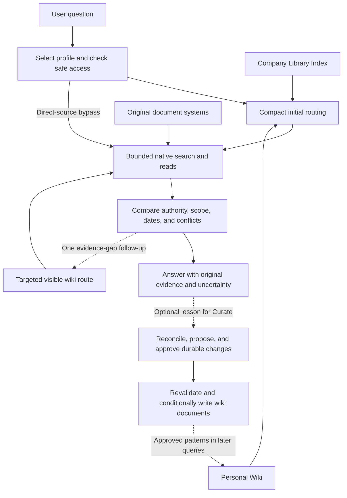

# Company Wiki: A Document-Native Semantic Routing Layer for Enterprise Question Answering

**Technical manuscript — revised September 14, 2026**

**Implementation scope:** version 1.2.0, including source-access, capability, authorization, source-resolution, budget, and routing fixes.

## Abstract

Enterprise question answering requires more than finding text similar to a question. An assistant must interpret local terminology, distinguish current authority from obsolete or provisional material, combine evidence across organizational boundaries, and respect current access restrictions. We present **Company Wiki**, a portable agent skill that places a small, curated semantic routing layer over existing document collections. A shared Company Library Index records canonical concepts, aliases, authority cues, source routes, and selected typed relationships. A user-controlled Personal Wiki accumulates reusable investigation context and judgment. Neither layer replaces original evidence: each factual answer requires currently authorized source material read during the operation. The architecture starts with compact routing, permits one targeted follow-up for a concrete gap revealed by original evidence, and carries useful lessons into later queries through authorized curation. We distinguish read, transient-draft, and publication capabilities, with a conditional-write protocol for durable changes. A completed 20-question synthetic pilot passed all answer rubrics. Paired guidance experiments used fewer source reads. A fresh comparison under synchronous shell execution completed all 40 first attempts, but one answer omitted a required qualifier; an earlier empty-output failure remains in the record. Six targeted learning scenarios improved from five passes to six through an optional curation suggestion, without measuring accumulated learning. These observations do not establish wiki routing benefit, production access enforcement, or lifecycle reliability. The contribution is a document-native architecture and operational contract for separating organizational meaning, current evidence, and personal working knowledge without requiring a new corpus index.

**Keywords:** retrieval-augmented generation; enterprise knowledge; semantic routing; personal knowledge management; provenance; access control; agent skills.

## 1. Introduction

A company can possess the right document and still produce the wrong answer. An employee asks for the current attendance requirement, and search returns an old handbook alongside an approved policy and next year's draft. A customer-facing team asks about a critical service commitment, while the governing agreement uses a severity classification. A quarterly review names a migration as a possible explanation for declining retention, and an assistant reports it as an established cause. These failures concern terminology, authority, scope, and reasoning as well as retrieval relevance.

The product problem is therefore not simply how to expose more documents to a language model. It is how to preserve the organizational knowledge needed to select and interpret evidence without creating another repository of facts that must be synchronized with the originals. Copying each source into a wiki can simplify navigation, but it creates another surface on which content, permissions, and authority can become stale. Searching from scratch avoids that particular duplication while repeatedly discarding useful knowledge about definitions, source ownership, and previous investigations.

Company Wiki separates these responsibilities. The **Company Library Index** provides a governed map of shared concepts and evidence routes. The **Personal Wiki** retains the user's reusable context, including priorities, annotations, decision context, and investigation patterns. Existing document systems supply the evidence, versions, and access controls. The language-model host coordinates these components through an installable skill and the tools it already exposes.

The central hypothesis is that a relatively small amount of curated organizational meaning can improve evidence selection and interpretation across many questions. The map does not need to represent every document. It must help the assistant recognize the right concepts, identify the relevant authority, and investigate beyond the map when coverage is missing. Its utility depends on the quality of those decisions, rather than on the number of pages accumulated.

This manuscript makes three contributions:

1. A layered, document-native representation that separates shared semantics, personal working knowledge, and original evidence.
2. An operational protocol for bounded retrieval, learning through approved curation, operation-specific capabilities, audience-safe derivation, and conflict-protected document updates.
3. An explicit separation between available component evidence and the controlled experiments needed to establish routing benefit, personalization value, and deployment safety.

The current artifact is an agent skill, workflow references, examples, and test infrastructure. It is not a newly trained retrieval model or a production document service. Formal expressions below summarize design obligations; they are not proofs that a language model or provider satisfies them.

## 2. Related Work

### 2.1. Retrieval-augmented generation

Lewis et al. combine parametric generation with a dense index of Wikipedia passages, establishing a model architecture in which retrieved external memory conditions the answer [1]. Company Wiki operates at a different layer: it guides an existing agent's selection and interpretation of sources. It neither trains a retriever nor specifies the internal index used by a source provider. Its lack of a required vector database is a deployment choice, not evidence that dense retrieval is unnecessary or inferior. [Retrieval-Augmented Generation for Knowledge-Intensive NLP Tasks](https://arxiv.org/abs/2005.11401).

### 2.2. Graph and hierarchical retrieval

GraphRAG derives an entity graph and community summaries from source documents to support questions requiring a global view of a corpus [2]. RAPTOR constructs a hierarchy by recursively embedding, clustering, and summarizing text, then retrieves across levels of abstraction [3]. Company Wiki instead maintains a selective, curated taxonomy with a small typed-link overlay. Its tree organizes navigation; it is not a recursively generated summary index. This choice avoids requiring corpus-wide preprocessing, while leaving global synthesis and long-tail recall dependent on the underlying search tools and retrieval budget. No performance comparison with either method is claimed. [GraphRAG](https://arxiv.org/abs/2404.16130), [RAPTOR](https://arxiv.org/abs/2401.18059).

### 2.3. Knowledge organization and provenance

SKOS provides a model for concepts, lexical labels, hierarchies, and associative relationships [4]. These distinctions motivate the use of canonical concepts, aliases, and explicit links in a lightweight wiki. Company Wiki uses ordinary documents and native links; it does not claim SKOS conformance or require an RDF store. PROV-O represents provenance through entities, activities, agents, and derivation relationships [5]. The corresponding concern here is preserving the original source, version, checked date, and origin near a derived claim. Readable provenance supports inspection, but is not itself an authorization mechanism. [SKOS Reference](https://www.w3.org/TR/skos-reference/), [PROV-O](https://www.w3.org/TR/prov-o/).

### 2.4. Tool-using agents

ReAct interleaves reasoning with actions that obtain information from external environments [6]. Company Wiki similarly supports investigation through tool use. It begins with permitted compact wiki context and one routing decision, then investigates original sources. One targeted follow-up may resolve an authority, alias, or exception gap revealed by the evidence, using at most three known visible wiki pages within the same profile and traversal limits. Further source retrieval remains bounded. The effect of this allowance on difficult questions requires measurement. [ReAct](https://arxiv.org/abs/2210.03629).

The proposed contribution lies in the combination of document-native knowledge organization, personal context, explicit evidence authority, and lifecycle boundaries. It is not a claim that taxonomies, provenance, or agentic retrieval are individually new.

## 3. Problem Formulation

Let $D$ denote the available original documents, $u$ a requesting user, $t$ the time of an operation, and $q$ a question. A selected configuration profile declares a bounded set of source locations $B$ and a separate wiki destination $W$. Let $A_u(t)$ be the source material the host can establish that the user may currently access. The eligible evidence space is

$$
D_{u,B}(t) = D \cap B \cap A_u(t).
$$

The notation includes document metadata when that metadata is access-sensitive. A readable title, alias, or link is already a disclosure; authorization cannot be deferred until the document body is opened.

Let $K_C$ denote the safely readable shared index and $K_u$ the safely readable Personal Wiki. The agent constructs a routing plan

$$
\pi = R(q, K_C, K_u),
$$

then uses host-provided search and read tools to obtain an evidence set $E$ within $D_{u,B}(t)$. The route may specify aliases, likely source areas, authority types, typed links, and an investigation pattern. It may also select direct search with no wiki reads.

Two constraints are essential. First, the eligible evidence space comes from explicit source bounds and access checks, not from wiki coverage. A relevant document does not become ineligible merely because it lacks a node in the map. Second, the wiki supplies retrieval context rather than factual sufficiency. Each factual assertion in an answer must be supported by original evidence read in the current operation, with interpretation and unresolved conflict made explicit.

Evidence authority is question-dependent. Approval status, effective date, applicability, version, and explicit supersession must be compared together. A newer draft does not automatically outrank an older approved policy. A general policy does not necessarily settle a question governed by a more specific agreement. Where the retrieved evidence does not establish precedence, the answer must preserve the uncertainty.

The design aims to improve answer quality while controlling search effort and maintenance burden. These objectives can conflict: additional curation may improve routing but increase upkeep; tighter retrieval bounds improve predictability but can prevent complete answers. The current implementation supplies operating defaults rather than a learned optimizer for these tradeoffs.

## 4. Architecture and Representation

### 4.1. Three knowledge scopes over existing sources

The architecture distinguishes a Company Library Index governed by a company administrator, optional Team Wikis governed by designated curators, and user-controlled Personal Wikis. Team scope is representable in the current model but does not have a separate V1 workflow. Lower scopes reference shared knowledge instead of cloning it.



*Figure 1. Query execution and durable knowledge growth are separate operations. Access checks apply before protected routing content or source evidence enters the model; every durable write additionally requires the publication contract in Section 6.*

The shared index answers questions such as which concept a term denotes, where the governing definition lives, and which source type should be consulted. Personal knowledge answers a different set of questions: why a topic matters to this user, what has already been investigated, which hypotheses remain open, and which evidence routes have proved useful. Personal context can change the investigation priority, but cannot make a company fact true or expand access rights.

### 4.2. Taxonomy, navigation tree, and typed links

A scope has a readable home or map. A canonical node records a title, aliases, a concise scope, a source entry point, and a primary parent. The primary-parent structure supplies a stable navigation route. Tree placement alone makes no claim of ownership, dependency, causation, or policy authority.

Selected typed links express relationships that placement cannot convey. Examples include `governed_by`, `depends_on`, `supersedes`, and `related_to`. Such links must be reviewable and evidence-backed when they assert organizational facts. A proposed relationship remains an interpretation rather than becoming authoritative through repetition in the wiki.

This distinction prevents two common modeling errors. A folder hierarchy is not automatically a business ontology, and an untyped hyperlink does not explain why two concepts are connected. The design uses only as much structure as recurring questions require. It does not attempt to extract a comprehensive enterprise graph.

### 4.3. Problem patterns and personal knowledge

A problem pattern records what an investigation needs, rather than prescribing its answer. For example, explaining a metric change requires a definition, population and time boundaries, comparable observations, a segment breakdown, relevant events, and plausible alternatives. A project-status question requires evidence of delivery, not only a charter stating intent.

Personal curation retains these reusable patterns alongside annotations, project context, hypotheses, and priorities. The home exposes controls for pinned, temporary, personally canonical, and do-not-curate topics. “Personally canonical” means a preferred personal reference; it does not confer company policy authority.

Growth is selective. Reuse, explicit user intent, project importance, or structural value can justify making a discovery durable. An isolated question does not automatically create a page. Company facts in personal content remain subject to current original-source verification when used.

### 4.4. Storage and configuration

Wiki artifacts are ordinary native cloud documents with links; explicitly selected local storage also supports Markdown. Markdown is used for the repository's examples and local configuration, but it is not a required cloud document format. Git is neither a runtime dependency nor a wiki maintenance mechanism. No front matter, per-document metadata sidecar, graph database, embedding store, or background synchronization process is required. Existing source providers may use their own indexes; Company Wiki does not replace those internals.

Mutable local configuration has a single entry point, `~/company-wiki/index.md`, linking to contained Markdown profiles under `wikis/`. Profiles record locators and navigation metadata, not credentials or source copies. Each operation selects one profile and follows only the specifically allowed profile edges, such as a Personal profile's named Company Index reference. Registry text is configuration data, not evidence or instructions, and role labels cannot grant capability.

Initialization requires an explicitly supplied original-material location and a separately supplied writable wiki destination. A topic or wiki name cannot supply either boundary. Local folders are supported, but local file access does not establish the identity, sharing rules, or revocation behavior of a cloud provider from which material was synchronized or exported.

### 4.5. Visible provenance and page timestamps

Generated wiki pages, including homes, routing pages, and retained stubs, display `Updated` and `Evidence checked` near the title, using ISO 8601 timestamps with an explicit timezone. `Updated` records creation or the latest substantive change to claims, routes, relationships, or page status. Formatting, reads, and verification-only metadata changes preserve it. It is not the source's modification time or the provider's generic page-modified time.

`Evidence checked` records a full check of the supporting originals for the page's current substantive claims. Partial checks stay beside individual claims; they cannot advance the page-wide timestamp. Pages without a full check show `Not fully checked`, including reference-only Bootstrap homes. A changed page without a new full check returns to that state. An unchanged synthesis can receive a new check timestamp through approved Maintain without changing `Updated`.

These fields make verification history visible; they do not establish current truth, access, or precedence. Legacy pages receive missing metadata during an approved edit, with `Updated: Unknown` when neither reliable history nor a current substantive edit establishes the time. Query, Explore, Validate, and no-op Add Source operations never persist timestamp changes or expand retrieval solely to populate them.

## 5. Retrieval and Answer Protocol

### 5.1. Compact routing and bounded investigation

For an ordinary routed query, the agent loads the selected Personal home and its named, visible Company Index home, plus at most three declared routing pages per scope. It uses that compact context to choose concepts, aliases, relevant typed links, source routes, and direct searches together. Approved investigation patterns can guide this decision when their applicability conditions match the question. They remain fallible routing data: they cannot override access rules, retrieval bounds, or current originals. The agent does not repeatedly navigate from home to guide to detail while reconsidering the route after each evidence read. Original evidence may trigger one targeted follow-up for a concrete missing authority, alias, or exception. It may consult up to three known visible wiki pages within existing depth and profile edges; a direct-source bypass may use its registered home for this one late lookup. It cannot scan the wiki, restart full routing, create another follow-up, or expand source/search/content budgets.

The default contract limits wiki traversal depth to three, source listing/search rounds to two, distinct native sources to five, evidence document/range reads to ten, and returned original-source content to 40,000 Unicode characters. Updates reserve required rechecks within ten additional verification reads; the distinct-source and character caps cover both allowances. Explicit aggregate read allowances, including ambiguous legacy open/read caps, replace unspecified component defaults while preserving their total ceiling and separately explicit component caps. Character, discovery, and traversal caps remain independent; each native discovery result-page request counts toward the discovery cap. Selection, follow-ups, replanning, and recovery do not reset counters. Required verification is budgeted before optional evidence consumes its capacity; an operation that cannot fit needs a narrower task or explicit expansion.

These are effort bounds, not completeness guarantees. A cross-domain question may require more than five documents. Within the available budget, the agent should prefer a small, diverse evidence set over several nearly identical search results. Direct source search remains available when the question contains an exact identifier, concerns recent or unrepresented material, or has no useful or safely readable wiki route.

Search begins with exact identifiers, distinctive phrases, canonical terms, or aliases in the provider's supported syntax. A remaining search round targets a specific evidence gap, such as a missing authority, exception, conflicting version, or source-language term. Listings consume the same allowance as searches. Duplicate hits are removed while distinct versions and authority types are retained. A second search is unnecessary when the evidence already supports the requested answer and its material qualifications.

When supported, section or range reads preserve relevant context without loading an entire long document. Context must include governing definitions, exceptions, table headers and units, effective dates, and supersession notices needed for the claim. Search snippets locate evidence but do not replace original passage reads. Several sections of the same native document occupy one distinct-source slot, but each requested document/range counts as a read. All returned source characters count, including search snippets, repeated or overlapping passages, and partial failed responses. If a full document exceeds the remaining budget and bounded reads are unavailable, the agent reports the limit. Exhausted retrieval is a stopping condition, not proof of completeness or absence.

### 5.2. Current access, version comparison, and evidence

For each source, access and freshness are checked independently. A provider operation authenticated as the requester can establish current read access without a separate ACL enumeration. A broader bot or service account requires a host- or provider-enforced requester check before metadata or content enters the model. Denied or unestablished access excludes the evidence; a readable wiki, earlier answer, or retained source text cannot substitute for it. Availability limits must not reveal restricted metadata or distinguish hidden documents from absent ones.

When the interface exposes native revisions, Query compares the current source version with provenance for that exact source already present in the permitted routing context. A changed version makes affected wiki claims potentially stale, but the original passages determine whether their meaning changed. An unchanged version proves neither current access nor claim correctness. Missing version metadata does not block an authorized read, and timestamps are not equivalent version identifiers.

Relevant original evidence is read during every operation, even when versions match. If metadata and passage reads reveal mixed revisions that matter to the answer, the agent rereads within the remaining bounds or reports the unresolved limit. It flags material wiki drift in the response and offers an approved Maintain or Curate path for durable repair. It never silently refreshes pages, updates provenance, or reopens routing to hunt for missing version records.

### 5.3. Operational sketch

```text
Algorithm 1: Bounded evidence-grounded query

Input: question q, authenticated requester u, selected profile p
Output: supported answer, qualified partial answer, or safe refusal

1. Resolve p through the registry contract; establish its source bounds.
2. Check disclosure safety before loading derived routing material.
3. Choose either:
     a. bounded compact wiki context and one routing plan; or
     b. direct source search within independently registered bounds.
4. Search eligible sources within the remaining budget; enforce current
   requester access before exposing metadata or content.
5. Compare available source versions with loaded wiki provenance;
   read current original passages regardless of a version match.
6. Compare applicability, authority, status, dates, and supersession.
7. If evidence reveals a concrete routing gap and the one follow-up is unused,
   consult up to three targeted wiki pages within existing profile/depth limits.
   Resume source retrieval within remaining budgets; do not loop through routing.
8. Answer using originals read in this operation. Cite factual claims;
   label inference, conflict, material drift, and unresolved limits.
9. Optionally suggest one useful, supported lesson for separate Curate,
   using only already-read context and evidence.
10. Make no wiki, registry, skill, or original-source changes.
```

Explore uses the same read-only discipline to investigate a topic. Query produces an answer. Neither turns a useful result into a durable update implicitly. Exact quotations preserve the original passage's wording, whitespace, line breaks, and qualifications; paraphrases belong in the answer rather than an exact-quote field. A quote must both match the evidence read and support its associated claim.

### 5.4. Example: interpreting a retention change

The synthetic service-company corpus contains a canonical definition of a lapsed account, a quarterly account review, and a project charter. The definition uses at least 60 days without an active service contract. The review records an increase from 41 to 58 lapsed accounts, with 14 additional accounts in hospitality. The charter identifies Kestrel as a billing-platform project. The review presents migration-related invoicing delays and a price increase as possible contributors, without confirming either cause.

A useful answer must distinguish four things: the governing definition, the observed change, the project identity, and the causal uncertainty. It may calculate a net increase of 17 and the segment contribution. It cannot conclude that the migration caused the increase merely because the documents connect the subjects. These facts and the observed pilot answer are available in the [archived FQ08 result](../tests/rag-quality/baselines/2026-09-12/FQ08/result.json).

This example illustrates the intended role of a problem pattern: ensure that the investigation asks the right questions. It does not establish that wiki routing was responsible for the result; the recorded fixture case used direct source discovery.

## 6. Knowledge Lifecycle and Publication Boundaries

### 6.1. Explicit growth and maintenance

The lifecycle is `Init → Bootstrap → Explore ↔ Query → Curate → Add Source → Maintain → Validate`. This is a family of operations, not a mandatory sequence for every request.

| Operation | Purpose | Durable effect |
|---|---|---|
| Init | Build a small shared index through bounded representative sampling | Approved Company Index pages and registration |
| Bootstrap | Establish a minimal Personal Wiki referencing a selected index | Approved personal home and registration |
| Explore / Query | Investigate or answer from current original evidence | None |
| Curate | Retain reusable knowledge or promote a selected contribution | Approved changes in an authorized scope |
| Add Source | Reconcile an exact source or explicitly bounded batch | Smallest approved coherent wiki update |
| Maintain | Repair, refresh, merge, or restructure existing wiki knowledge | Approved corrections preserving concurrent work |
| Validate | Inspect structure, provenance, freshness, and safe visibility | Read-only findings |

*Table 1. Lifecycle operations and their authorized durable effects.*

Init does not attempt an exhaustive import. Bootstrap does not resample the corpus or copy index children: it creates a minimal personal home with a protected reference to the explicitly selected index. Source bounds must be supplied independently and cannot be inferred from the index's contents.

Query and Explore may offer at most one concise lesson after answering, using only already-read evidence and routing context. Useful candidates include an unfamiliar alias, source route, authority distinction, recurring exception, or investigation pattern with explicit applicability conditions. Routine answers, duplicate lessons, unsupported generalizations, unsafe disclosures, and do-not-curate topics are omitted. No extra retrieval is spent searching for a lesson, and recurrence is not claimed without available history.

The suggestion remains transient. If the user chooses to retain it, Curate reconciles it with existing destination knowledge and proposes concrete edits with original references, conditions, counterevidence, and uncertainty. The usual publication and approval protocol still applies. Only an approved, successfully saved pattern becomes durable routing context for later queries. This is learning through curated documents; the skill is stable during use, with no hidden memory, execution transcript store, or automatic model update. Acceptance of a suggestion is not evidence that it improves retrieval.

Add Source is deliberate reconciliation. Its compatibility alias, Ingest, does not denote an ETL pipeline or a background indexing stage. A title, keyword, or filename pattern can authorize bounded candidate discovery within the registered source scope. A specific unambiguous description can resolve directly to its exact native target from adequate scoped metadata. An explicitly requested finite batch can resolve to a complete enumerated snapshot. Report and freeze exact targets before body reads; no second selection turn is needed when intent and membership are clear. Ambiguity, truncation, incomplete membership, or generic patterns without batch intent require selection or refinement. A later match never joins the snapshot automatically. Discovery and resolution do not reset retrieval budgets, and required rechecks are reserved before reconciliation. Reconciliation with no material delta creates no processing receipt, duplicate node, or timestamp update. Original sources remain unchanged across all workflows.

### 6.2. Operation-specific capabilities

The host's existing plugins, MCP tools, CLIs, or APIs may support reading without supporting safe publication. Source and destination capabilities are assessed separately for the requested operation; connectivity to one does not prove authority or write protection at the other.

| Capability level | Required support | Permitted result |
|---|---|---|
| Read and answer | Bounded discovery when needed, current requester-authorized reads, usable evidence identifiers or links | Query, Explore, and the Validate checks the interface can establish |
| Draft changes | Authorized evidence and relevant target reads; a response audience authorized for that evidence | Transient concrete proposal with publication blockers; no wiki or registry writes |
| Publish changes | Read support plus exact-destination write/govern authority, current audience containment, safe permissions from creation, and protected operations required by the plan | Approved durable writes and protected registration when needed |

*Table 2. Capabilities are specific to an operation and destination, not guaranteed by an integration type.*

Ordinary read-only answers do not require destination write tools, audience enumeration, conditional writes, or optional source revisions. Validate reports unavailable checks as inspection limits; missing ACL visibility alone does not establish a leak. Missing requester authorization, however, blocks the affected evidence at every level.

When publication support is unavailable, useful authorized reads and transient drafting may continue with the specific blocker stated. User approval cannot supply missing provider enforcement. A draft visible to the requester is not cleared for the intended wiki audience, and the agent must not instruct the user to copy it there without verified disclosure authority. If an existing target cannot safely be read, an outline or limitation replaces an invented exact edit. Fallback preserves registry, selection, and retrieval boundaries and does not count as completed initialization.

### 6.3. Read authority and publication authority

The ability to read evidence does not establish the right to republish its meaning. Let $L(x)$ be the transitive set of evidence contributing to a proposed artifact $x$, including its title, aliases, links, relationships, and provenance. Let $\operatorname{Aud}(z,t)$ be the authorized audience of resource $z$ at publication or update time $t$. A necessary publication condition is

$$
\operatorname{Aud}(x,t)
\subseteq
\bigcap_{d \in L(x)} \operatorname{Aud}(d,t).
$$

The condition concerns actual derivation, not only the final citation list. Removing a restricted citation cannot make a conclusion safe when that conclusion was generated using restricted evidence. Shared generation must start from destination-authorized inputs. If earlier context contains excluded evidence, the host must provide clean regeneration with authorized inputs or decline that generation.

Provider-managed wiki access is the default: the provider enforces the destination's own approved permissions from creation. Authenticated source access, exact-scope publication authority, current audience containment, and applicable confidentiality restrictions remain required. Missing proof of future source-to-wiki permission propagation alone does not block otherwise authorized publication.

Continuous source inheritance is an additional requirement only when explicitly required by the user or governing policy. For that model, the provider must maintain containment after source revocation, destination widening, group changes, and inheritance changes across content, metadata, history, and exports. Unavailable required protection blocks affected publication. The skill provides no ACL synchronization service or recall of disclosed copies; ordinary wiki ACLs may remain unchanged when source access changes. Private user-owned local originals and synthetic fixtures retain the narrow local contract; local exports do not bypass provider authority or explicit inheritance requirements.

### 6.4. Protecting reads and updates

Ordinary wiki reads use provider-enforced current access, and factual reuse requires current original evidence. Known unsafe legacy material and destinations requiring continuous source inheritance need additional disclosure checks before bytes enter the model. If protected metadata or an enforced boundary cannot establish the required safety, the agent skips the page and uses an independently registered source route when available. Missing automatic inheritance alone does not establish unsafe exposure. An instruction to ignore restricted content after loading it is not an access boundary.

Durable changes follow a separate protocol. For an existing selected wiki, an explicit Add Source/Ingest, Curate, or Maintain request authorizes necessary bounded edits, retaining update intent through later exact source selection. Source selection alone and read-only requests authorize no writes. A review-first instruction requires approval of the exact proposal; setup and registration retain their concrete-proposal gates. Every write has a concrete plan identifying targets, changes, evidence versions, destination scope, audience checks, applicable access model, write order, and operation semantics. Immediately before applying it, the agent rechecks identity, authorization, evidence, targets, versions, and any explicitly required continuous inheritance. Material drift invalidates the plan. A task-authorized update may reconcile and revalidate within its scope while preserving concurrent edits; a materially changed exact proposal requires fresh approval. Missing decisions or additional authority stop the affected action.

Updates require provider-enforced version conditions or an equivalent verified exclusive-write mechanism. Creates require conditional creation or native idempotency with reconcilable outcomes. Rereading followed by an unguarded write leaves a concurrency gap and is insufficient. Dependencies are created and verified before links to them are exposed, while each intermediate artifact must independently satisfy publication safety.

Source freshness and destination concurrency protection are separate capabilities. A readable source revision, timestamp, or content hash does not establish protected writes at the destination. Preflight checks the exact create and update operations in the approved plan; support for one does not imply support for the other.

A failed response is not necessarily a failed write. A timeout may follow a committed operation. The protocol stops subsequent writes and reconciles exact approved targets or native operation keys, distinguishing confirmed success, confirmed failure, unknown outcome, and unattempted work. Recovery preserves successful and concurrent edits; it does not automatically roll back. Registry updates and provider writes are not assumed to form one atomic transaction. Without sufficient native operation identity after a crash, recovery may remain unresolved.

## 7. Implementation Status

The repository implements the product primarily as a portable instruction package in `skills/company-wiki/`, supported by focused lifecycle references. The package delegates search, reads, authentication, and conditional writes to the host and its existing provider tools. There is no independent production service in this repository that can enforce those provider capabilities on its own.

Version 1.1.0 introduced optional Query-to-Curate learning, bounded Add Source candidate discovery, and visible page timestamps, alongside provider-managed publication guidance. Version 1.2.0 adds Query source-access/version checks, read/draft/publish capability separation, bounded task authorization, direct resolution of unambiguous source selections, separate retrieval and verification budgets, and one evidence-triggered routing follow-up. The evaluation below identifies the earlier guidance snapshots actually exercised; its results do not validate these later changes.

The shipped examples demonstrate flat linked documents and separate synthetic originals. A deterministic local lifecycle adapter provides bounded logical targets and fault controls. Static contract tests check that required workflow rules remain present; adapter tests exercise local behavior. These mechanisms support development and regression detection, but a successful static assertion or simulated permission failure does not establish production access enforcement.

A separate Python benchmark runs actual Codex sessions against a read-only synthetic corpus tool. Its JSON datasets, traces, hashes, and evaluator records are test infrastructure. They are not runtime wiki sidecars, source indexes, or a new requirement on user document collections.

The main implementation distinction is thus between **specified obligations**, **locally exercised behavior**, and **provider capabilities requiring deployment evidence**. The article treats them separately throughout.

## 8. Preliminary Component Evaluation

### 8.1. Dataset and procedure

The [synthetic RAG benchmark](../tests/rag-quality/README.md) defines 20 development questions over two bounded corpora. Twelve fixture questions cover policy authority, superseded and draft documents, terminology mismatches, ownership, approval thresholds, conflicting definitions, multi-source diagnosis, missing evidence, false premises, project intent versus completion, and a Chinese query over English sources. Eight example questions use the shipped wiki and seven synthetic originals for policy and customer-metric tasks.

Each evaluated session receives one question in a fresh ephemeral context. The corpus tool supports directory listing, regular-expression search over originals, and full document reads. Gold evidence identifiers and atomic answer criteria are withheld from the evaluated process. The configured session uses `gpt-6-astra`, high reasoning effort, and `codex-cli 0.154.0`, as recorded in the run manifest.

The September 12 pilot used the runner's hardcoded answer and retrieval contract without loading the Query reference. The September 13 comparisons and their synchronous follow-up freeze and embed that reference, varying only its guidance within each paired experiment. Benchmark-specific tool, routing, and output rules take precedence. These runs do not execute registry selection, natural skill discovery, provider authorization, or durable curation. The later source-access and capability fixes are outside the measured snapshots.

Trace checks reject observed tools or commands outside the allowed corpus invocation. Source hashes check that originals remain unchanged. New runs use a short, corpus-bound `./corpus-tool` launcher whose binding and hash are also checked, avoiding reproduction of long temporary command paths. These checks assess evaluation integrity; they are not an operating-system or cloud-provider security proof. Listing/search, original-read, and character budgets follow the Query contract. Example navigation additionally requires the home first, at most three further wiki reads, and no wiki reads after source search or reading starts. Full-document-only fixtures do not exercise long-document passage retrieval.

### 8.2. Measures

For question $i$, let $G_i$ be the gold set of required originals and $O_i$ the originals opened. Required-source-open recall is

$$
\operatorname{Recall}_i = \frac{|G_i \cap O_i|}{|G_i|}.
$$

This measures recovery of the specified evidence, not exhaustive recall of every relevant document. Search snippets do not count as full reads. Citation integrity checks that a quoted span occurs exactly in an original read during the operation and that its identifier appears inline. It does not test whether the quote entails the associated claim.

Semantic review separately evaluates atomic answer criteria and whether the complete answer contains unsupported factual assertions. A strict answer pass requires every criterion to pass and the answer to be judged grounded. Unreviewed answers remain unscored; they are neither semantic passes nor semantic failures.

Execution validity is reported separately from semantic quality. An invalid execution receives no quality score even when its answer appears correct. Execution rates count questions; citation integrity rates count quotations from valid executions. Effort comparisons use the same valid question set in both conditions and disclose excluded cases. Fewer quotations do not imply worse citation integrity.

### 8.3. Completed historical pilot

The [versioned September 12 baseline](../tests/rag-quality/baselines/2026-09-12/README.md) preserves the completed pilot: all 20 questions were executed and semantically reviewed. It supersedes the ten-completed/eight-reviewed snapshot reported in the initial manuscript; no answers were rerun or regraded for this revision.

| Measurement | Recorded result | Denominator or interpretation |
|---|---:|---|
| Completed and semantically reviewed cases | 20 / 20 | Twelve fixture and eight example questions |
| Strict answer pass | 20 / 20 | Every rubric criterion plus grounding |
| Atomic rubric criteria satisfied | 59 / 59 | Agent-reviewed criteria |
| Answers judged grounded | 20 / 20 | Agent semantic review |
| Mean required-source-open recall | 100% | Twenty cases |
| Citation integrity | 90 / 90 | Exact quotation, observed read, and inline reference |
| Within retrieval bounds | 20 / 20 | Two discovery rounds, five original opens, 40,000 characters |
| Example navigation checks | 8 / 8 | Example cases only |
| Mean original documents opened | 2.7 | Twenty cases |
| Mean elapsed time | 29.04 seconds | Includes CLI startup |

*Table 3. Completed historical component pilot. Source: the [archived scorecard](../tests/rag-quality/baselines/2026-09-12/scores.json) and [reviewed answers](../tests/rag-quality/baselines/2026-09-12/report.md).*

The recorded host usage totals are 1,770,407 input tokens, including 1,337,216 cached input tokens, and 9,754 output tokens. Input usage includes host context, so it cannot be interpreted as retrieved evidence volume or compared directly with a minimal standalone RAG pipeline. No cost advantage follows from these measurements.

The reviewed responses distinguish approved policies from drafts, preserve threshold exceptions and competing definitions, separate metric arithmetic from causal explanation, and answer the Chinese question over English evidence. Navigation was exercised in the example cases. Because fixture and example questions use different corpora, these results do not isolate the value of wiki routing.

### 8.4. Strengthened retrieval guidance

The [September 13 corrected comparison](../tests/rag-quality/query-comparison-fixed-2026-09-13.md) compares original retrieval guidance with strengthened search, reading, and stopping guidance. Both conditions receive the same exact-quote guidance and fixed corpus launcher; paired prompts differ only inside the frozen Query-reference block. Questions, originals, model, reasoning effort, budgets, and scorer are held constant. A [synchronous-backend follow-up](../tests/rag-quality/query-execution-2026-09-14.md) repeats those same frozen references with `unified_exec` disabled in both conditions. Table 4 reports the new first attempts; main-run prompts do not force listing.

| Measurement | Original retrieval | Strengthened retrieval |
|---|---:|---:|
| Valid executions | 100% (20/20) | 100% (20/20) |
| Strict answer passes among valid executions | 20/20 | 19/20 |
| Atomic answer criteria satisfied | 59/59 | 58/59 |
| Required-source-open recall among valid executions | 100% | 100% |
| Exact citation integrity | 100% (68/68 quotes) | 100% (67/67 quotes) |
| Valid executions within retrieval bounds | 20/20 | 20/20 |
| Example navigation checks | 8/8 | 8/8 |
| Chinese question | Pass | Pass |
| Mean source reads, all 20 cases | 2.75 | 2.40 |
| Mean source characters, all 20 cases | 1,615.75 | 1,435.35 |

*Table 4. New first attempts with synchronous shell execution. All 20 cases enter both effort averages; historical execution failures are preserved separately.*

The historical corrected comparison retains 20/20 valid executions before and 19/20 after: strengthened FQ04 recorded exit code zero with an empty listing payload and remains invalid and unscored. Its mechanism is unconfirmed. The synchronous backend is a mitigation, with the strict JSON validator and citation scorer unchanged. All 100 direct listing checks and six new forced-listing FQ04 diagnostics passed; the latter exercised listing three times per guide before the full repeat. All 130 command payloads in the new comparison were present. Neither diagnostics nor new runs replace historical observations, including the earlier citation and Chinese-command failures in the [original comparison](../tests/rag-quality/query-comparison-2026-09-13.md).

In the new 20-case comparison, source reads fell from 55 to 48 (12.7%) and source characters fell 11.2%. Required evidence and exact citations were retained, but After/EQ05 omitted an explicit calendar-month qualifier from its answer text. Its citation contains that qualifier; conservative answer-text grading marks one criterion incomplete, giving 19/20 strict answer passes and 58/59 criteria after strengthening. These results do not establish unchanged strict answer quality. Mean elapsed time was 29.42 versus 26.64 seconds; total input tokens fell 3.1% while uncached input rose 5.5%. The historical 19-case effort comparison remains 58 versus 47 reads, a separate observation. Concurrent execution, service latency, cache differences, and the backend change between experiments prevent general speed, monetary-cost, or between-experiment causal claims. Neither comparison isolates the wiki itself.

### 8.5. Query learning and optional curation

The [learning comparison](../tests/rag-quality/query-learning-2026-09-13.md) uses the Query reference at `48fb719` as its before condition and adds approved-pattern routing and optional learning-handoff guidance after it. The same 20 questions, originals, tools, budgets, answer schema, and scorer are used, with one fresh session per question and condition. No answer or lesson carries between sessions, and no curation writes occur.

| Measurement | Before learning guidance | After learning guidance |
|---|---:|---:|
| Valid executions | 20/20 | 20/20 |
| Strict answer passes | 20/20 | 20/20 |
| Atomic answer criteria satisfied | 59/59 | 59/59 |
| Required-source-open recall | 100% | 100% |
| Exact citation integrity | 55/55 quotes | 56/56 quotes |
| Within retrieval bounds | 20/20 | 20/20 |
| Example navigation checks | 8/8 | 8/8 |
| Total original-document reads | 49 | 45 |
| Mean source characters | 1,454.4 | 1,367.3 |
| Total input tokens | 1,838,209 | 1,922,799 |
| Mean elapsed time | 28.20 seconds | 28.17 seconds |

*Table 5. Independent-query comparison of learning guidance; it does not measure accumulated wiki learning.*

Reads fell 8.2% and source characters fell 6.0%, while input tokens rose 4.6% and elapsed time was essentially unchanged. The read reduction came entirely from two leave-policy questions; the other 18 used the same number of originals. No factual accuracy improvement was measured, and the results cannot be attributed to learned wiki content because none was saved.

Six separate [synthetic stage probes](../tests/rag-quality/query-learning-probes.md) examine useful-lesson suggestions, do-not-curate preferences, duplicate suppression, failed-search uncertainty, stale patterns, and initial routing with an approved pattern. The before condition passed five of six scenarios and 13 of 14 criteria; the after condition passed all six and all 14. The difference was a supported optional Curate suggestion about a customer-specific signed service exception. Both conditions answered the factual question correctly. The probes supplied context and evidence directly, used no tools, and tested neither actual publication nor later reuse of a saved lesson.

An initial probe checker incorrectly treated a CLI startup notice as an unauthorized action. A separate revalidator allowed only that exact non-action notice while retaining rejection of other errors and all tool actions. The scenario results use the corrected validation of the same 12 traces and unchanged answers; no replacement model runs were used. The retained report documents this correction.

### 8.6. Threats to validity

The full comparisons use short synthetic development documents and one execution per question and condition. The focused output diagnostics repeat FQ04 three times per guide; they do not estimate general reliability. The pilot reviewer also authored the cases; later comparisons were reviewed by the implementing agent with condition labels visible. None was independently reviewed or human-calibrated. The learning probes were authored specifically for the feature. Conditions ran concurrently, with sequential questions within each; additional probe activity overlapped part of the learning experiment. Timing and token differences include host, service, and cache effects.

The completed pilot covers example navigation and one cross-language case, but the two corpora still differ. Guidance comparisons do not substitute for a same-corpus comparison with and without wiki routing. The historical pilot retains auditable answers and scores in version control; the newer comparisons retain tracked reports but keep exact execution artifacts in Git-ignored local results. Appendix A distinguishes their reproducibility limits.

Consequently, the observed perfect scores on reviewed cases support no general estimate of production accuracy, robustness, or comparative superiority. They also say nothing about live provider search relevance, revocation, publication containment, large collections, or adversarial prompt-injection resistance. These require separate experiments.

## 9. Evaluation Required to Test the Product Hypothesis

### 9.1. Paired routing and personalization experiments

The guidance comparisons in Section 8 do not test the central routing hypothesis. A controlled comparison should hold questions, originals, model, tool access, source budgets, and answer rubrics constant while varying routing context:

| Condition | Available routing context | Main comparison |
|---|---|---|
| A | Direct LLM and native source search | Answering baseline |
| B | Company Library Index and the same source search | Incremental shared-index contribution |
| C | Personal Wiki, Company Library Index, and the same source search | Incremental personal-context contribution |

Question order should be randomized, generation repeated, and answer review blinded to the condition. Report paired differences and uncertainty for strict answer success, evidence recall, authority errors, citation entailment, reads, discovery calls, latency, and token use. Matching source budgets tests performance under equal evidence limits; an additional matched-total-cost analysis is needed because wiki context itself consumes time and tokens.

Personalization requires a longitudinal split. Build personal knowledge through authorized curation on earlier tasks, then evaluate on later held-out questions. Reusing the exact development questions would risk measuring memorized routes. Include source changes and novel topics to determine whether personal context accelerates investigation or anchors the agent to stale assumptions.

The experiment must execute the full learning path: supported candidate, approved concrete curation, successful protected save, and later retrieval of that saved pattern. Compare against a frozen wiki on held-out questions, recording both helpful reuse and stale-pattern errors. A transient suggestion or supplied pattern in a stage probe does not establish this outcome.

### 9.2. Ablation and coverage stress

Useful ablations remove aliases, authority cues, typed links, or problem patterns while preserving the rest of the map. They test whether a particular representation element improves an identifiable failure mode. Deliberately incomplete and stale taxonomies test the claim that the map guides retrieval without excluding unrepresented evidence. A comparison of initial-only routing with the single bounded follow-up would test its effect on evidence recall and retrieval effort. The earlier fixed-routing measurements do not establish that effect.

Larger and longer-document corpora should include near-duplicate policies, ambiguous names, non-text content, contradictory authority signals, and questions requiring more evidence than the default budget permits. Correctly reporting an exhausted bound should be scored separately from answering a question completely.

### 9.3. Governance and lifecycle acceptance

Provider acceptance must operate against real identities and exact test destinations. Scenarios should cover denied reads, metadata exposure, source revocation, destination widening, group changes, inherited access, historical versions, previews, and exports. Each scenario should inspect what a less-privileged principal can actually obtain. Agent statements that access is safe are not sufficient observations.

Capability tests should independently remove source revisions, ACL visibility, destination write tools, protected creates, and protected updates. Authorized Query should continue without publication capabilities; unsupported publication should produce only an authorized transient result. Broader service accounts must demonstrate requester checks before disclosure. Version tests should cover unchanged revisions, changed meaning, unavailable metadata, and drift between metadata and passage reads, while verifying that Query never refreshes page timestamps.

Mutation tests should inject source and target drift, concurrent edits, create collisions, timeouts after commit, partial failures, and lost operation identity. The expected outcome is bounded recovery that preserves concurrent work and reports unknown states accurately. A host unable to enforce the publication contract should be evaluated for correct refusal of durable publication, not credited with unsupported guarantees.

### 9.4. Maintenance economics

The product hypothesis is incomplete without measuring the cost of keeping the map useful. A longitudinal study should record curator effort, accepted versus rejected changes, reuse of retained knowledge, stale-route incidents, page growth, and repair time. A larger Personal Wiki is not inherently better. Routing improvements must justify additional reading and maintenance, and retirement decisions should reduce accumulated clutter without losing useful context.

## 10. Discussion and Limitations

The architecture concentrates organizational interpretation in a small, inspectable layer. This is useful when definitions, authority, and source ownership repeatedly affect decisions. It also exposes a practical weakness: curation quality becomes a dependency. Incorrect aliases or unjustified authority cues can systematically misdirect many future questions. Source rechecking limits factual reuse but does not eliminate route-selection bias.

Avoiding a new ingestion pipeline reduces required infrastructure. It also leaves recall, ranking, pagination, and supported formats to existing providers. The design offers no guarantee of fast retrieval over a large corpus or comprehensive synthesis across all documents. For questions already expressed as exact identifiers, the direct-search path may be sufficient and additional routing context may add overhead.

Human-readable documents and links make knowledge inspectable in the chosen provider's document tools, while providing weaker structural enforcement than a dedicated schema service. Broken links, inconsistent aliases, and unsupported relationships require explicit validation. Visible timestamps improve auditability but do not replace current evidence. Likewise, an instruction package cannot supply concurrency control, clean-context isolation, or continuing authorization that the host lacks. Unsupported publication capabilities constrain durable deployment while leaving independently authorized reads and transient drafting available.

Cross-provider derivations require clear publication authority because source and destination permissions may be independent. Ordinary authorized publication can use destination-managed access. If a deployment explicitly requires continuing source inheritance and the providers cannot enforce it, affected persistent pages remain unavailable. The default does not promise automatic revocation of previously published wiki content.

Finally, selective personal knowledge can preserve useful judgment or reinforce old assumptions. An annotation can outlive the situation that made it helpful. The separation of personal preference from company authority, visible uncertainty, explicit maintenance, and evaluation on changed sources are therefore central to the design. Their effectiveness remains an empirical question.

## 11. Conclusion

Company Wiki proposes a document-native semantic routing layer for enterprise question answering. Shared concepts and source routes provide organizational context; a Personal Wiki retains deliberate working knowledge; original documents supply current evidence. Bounded retrieval, visible provenance, learning through approved curation, and separate read, draft, and publication capabilities keep these responsibilities distinct.

The completed synthetic pilot and subsequent guidance comparisons demonstrate selected retrieval, answer, and optional curation behaviors under constrained contracts. Fewer source reads and a better learning handoff do not establish the incremental value of wiki routing, accumulated learning, or production governance guarantees. The decisive next evidence is a same-corpus routing comparison, followed by actual curation and held-out reuse, longitudinal maintenance studies, and provider-specific acceptance. The product succeeds if its curated map improves decisions and investigation efficiency enough to repay the effort required to keep that map accurate.

## References

1. Patrick Lewis et al. 2020. **Retrieval-Augmented Generation for Knowledge-Intensive NLP Tasks.** NeurIPS 2020. [arXiv:2005.11401](https://arxiv.org/abs/2005.11401).
2. Darren Edge et al. 2024. **From Local to Global: A Graph RAG Approach to Query-Focused Summarization.** [arXiv:2404.16130](https://arxiv.org/abs/2404.16130).
3. Parth Sarthi, Salman Abdullah, Aditi Tuli, Shubh Khanna, Anna Goldie, and Christopher D. Manning. 2024. **RAPTOR: Recursive Abstractive Processing for Tree-Organized Retrieval.** [arXiv:2401.18059](https://arxiv.org/abs/2401.18059).
4. Alistair Miles and Sean Bechhofer, editors. 2009. **SKOS Simple Knowledge Organization System Reference.** W3C Recommendation, August 18, 2009. [W3C specification](https://www.w3.org/TR/skos-reference/).
5. W3C. 2013. **PROV-O: The PROV Ontology.** W3C Recommendation, April 30, 2013. [W3C specification](https://www.w3.org/TR/prov-o/).
6. Shunyu Yao, Jeffrey Zhao, Dian Yu, Nan Du, Izhak Shafran, Karthik Narasimhan, and Yuan Cao. 2022. **ReAct: Synergizing Reasoning and Acting in Language Models.** [arXiv:2210.03629](https://arxiv.org/abs/2210.03629).

## Appendix A. Artifact Provenance and Reproducibility

This revision describes version 1.2.0, inspected on September 14, 2026. Historical benchmark measurements retain their recorded code, fixed read caps, and initial-only routing contract; they do not validate the newer defaults. The primary product sources are the [changelog](../CHANGELOG.md), [README](../README.md), [PRD v0.5](company-wiki_PRD_v0.5.md), [skill package](../skills/company-wiki/SKILL.md), and its [document format](../skills/company-wiki/references/document-format.md), [Query protocol](../skills/company-wiki/references/query.md), [Curate workflow](../skills/company-wiki/references/curate.md), [Add Source workflow](../skills/company-wiki/references/add-source.md), [publication boundary](../skills/company-wiki/references/publication.md), and [change protocol](../skills/company-wiki/references/change-protocol.md). Where planning documents are broader or older, the current focused workflow references define the operation described here.

The experimental evidence comes from the [benchmark definition](../tests/rag-quality/README.md), [dataset](../tests/rag-quality/dataset.json), [runner](../tests/rag-quality/benchmark.py), [versioned September 12 baseline](../tests/rag-quality/baselines/2026-09-12/README.md), [corrected retrieval comparison](../tests/rag-quality/query-comparison-fixed-2026-09-13.md), and [learning comparison](../tests/rag-quality/query-learning-2026-09-13.md). This revision adds six forced-listing diagnostics and a fresh 40-session comparison, with source-backed semantic review of all answers, documented in the [synchronous execution follow-up](../tests/rag-quality/query-execution-2026-09-14.md).

| Artifact | Recorded identity |
|---|---|
| Historical pilot start | `2026-09-12T14:13:35.923332+00:00` |
| Completed archived scorecard SHA-256 | `3f9d9cc33762b1634a8f455cd0d1a2047d96c937a04aabc22b0b2985bbd7ad12` |
| Pilot dataset SHA-256 | `f1d34da1b835ea51cde3a5049c3c3cd5108ab91214b209b768785735187ae54a` |
| Pilot runner SHA-256 | `258436c4df1b2b42cb92d53ed02b0696f3da1b63a9c159ee7c83213a492e8196` |
| Learning comparison frozen Before Query SHA-256 | `4f773c18b715d2ca45844ddc43b3456be4cd78d8918d13e59ba61b8acb95fb21` |
| Learning comparison frozen After Query SHA-256 | `920346b9f829405ba1124f27a557049dafd78347f23b773435285d4345252bf5` |

The versioned baseline retains exact answer bytes, citations, processed retrieval records, reviews bound to answer hashes, scores, source hashes, and dataset/runner snapshots. Its scorecard can be regenerated from a clone without another model call. Raw CLI traces and temporary-path prompts remain local; the archive preserves their validation verdicts, not enough raw material to independently repeat command-level validation.

For the September 13 comparisons, tracked reports preserve measurements, design, failures, and review conclusions. Exact prompts, frozen references, answers, traces, and verification files remain under Git-ignored `tests/rag-quality/results/2026-09-13-query-comparison-fixed/` and `tests/rag-quality/results/2026-09-13-query-learning/`. They were available for this revision but are not shipped as versioned baselines. The learning Query hashes identify the tested reference before later source-access and capability edits; the current reference is not byte-identical to that experimental snapshot.

Repeating model execution requires compatible authenticated CLI access, the exact experiment inputs, and a fresh output directory. Rerunning a mutable model alias does not guarantee identical generations. The benchmark instructions describe execution and answer-hash-bound semantic review; regenerating reports cannot replace missing executions, raw traces, or semantic reviews.

The synchronous follow-up retains its design, prompts, frozen references, answers, traces, reviews, and verification under Git-ignored `tests/rag-quality/results/2026-09-14-query-comparison-synchronous/`; focused diagnostics are under `tests/rag-quality/results/2026-09-14-empty-output-investigation/`. Its runner SHA-256 is `701acca3a7fbab36e8bf23953902f89ca44f4b763ad1e8a0140c7df1062e0215`. The tracked report is `tests/rag-quality/query-execution-2026-09-14.md`. The historical runner and Query hashes above remain unchanged; the new repeat uses the earlier retrieval references, not the current product reference.
