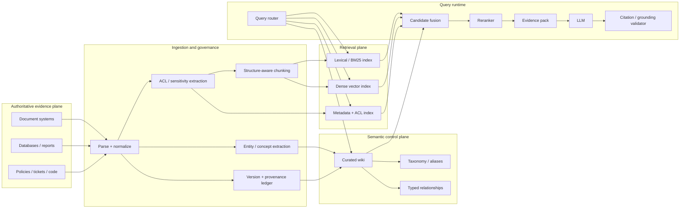
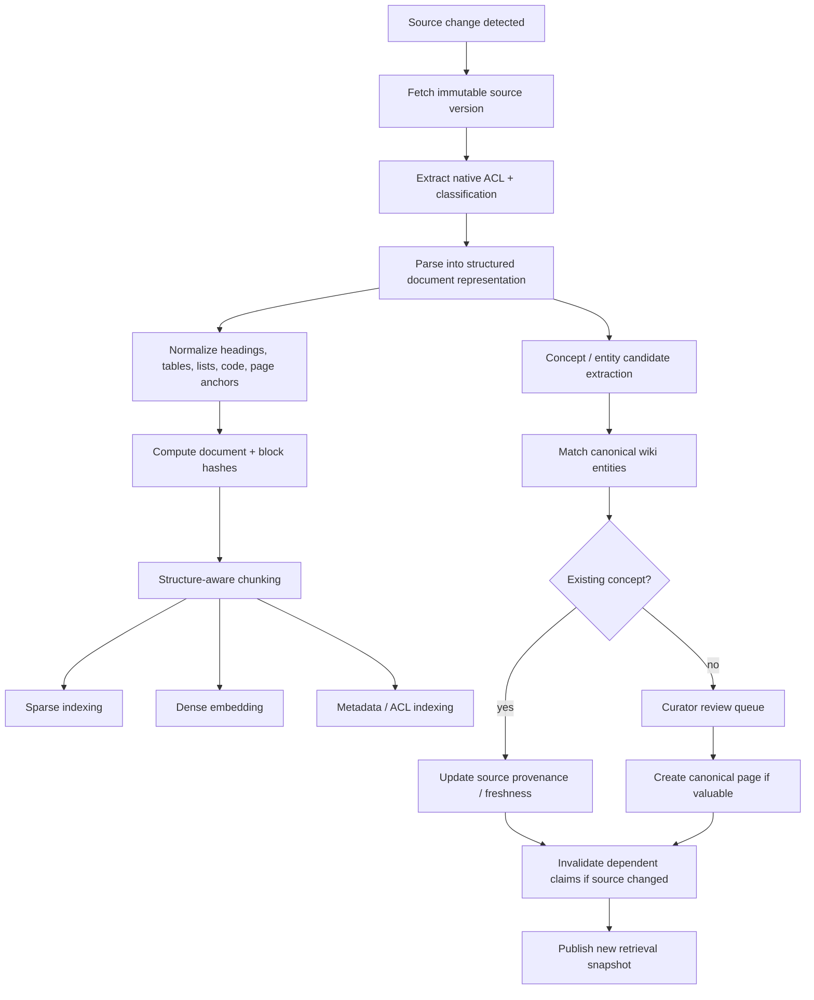

# Curated Wiki as a Navigation and Reasoning Layer for Enterprise RAG

## Executive summary

**Verdict: yes—with an important qualification.** A curated wiki can be an excellent **navigation, semantic, governance, and reasoning layer** over a company document library, but it is usually a poor choice as the sole retrieval corpus or as a manually maintained duplicate of the underlying documents. The strongest design is a **hybrid, dual-plane architecture**:

1. **The source document library remains the authoritative evidence plane.**
2. **A curated wiki becomes the semantic control plane**: canonical concepts, aliases, taxonomy, relationships, business definitions, process maps, decision records, source pointers, provenance, ownership, and retrieval hints.
3. **Sparse + dense retrieval operates primarily over source-document chunks**, with wiki pages and wiki-derived metadata used for query routing, filtering, expansion, graph traversal, reranking, and context selection.
4. The answering model receives **source-level evidence**, not merely wiki summaries, and produces claim-level citations back to immutable source versions or spans.

That architecture aligns well with the motivation behind RAG itself: explicit non-parametric memory makes knowledge easier to update and gives answers provenance that a purely parametric model lacks. The original RAG work explicitly identified knowledge updating and provenance as core problems and found retrieval-augmented generation more factual than a parametric-only baseline on its evaluated tasks. citeturn29view0 Dense retrieval also has real advantages over keyword-only retrieval—DPR reported 9–19 percentage-point absolute improvements over a strong Lucene-BM25 baseline in top-20 retrieval accuracy on its open-domain QA benchmarks—but that does **not** imply lexical retrieval should be discarded. citeturn28view1 Modern hybrid systems deliberately combine lexical and semantic retrieval because identifiers, exact terminology, names, numbers, and conceptual queries behave differently; Qdrant's current documentation, for example, supports dense+sparse retrieval and rank fusion such as Reciprocal Rank Fusion. citeturn33view0

The key architectural distinction is this:

> **Make the wiki canonical for meaning and navigation, but not automatically canonical for evidence.**

A page named `Customer Churn`, for example, can be the canonical place defining the organization's preferred term, aliases, responsible team, related metrics, systems, and authoritative documents. But when an answer says, “Enterprise churn was 4.7% in Q2,” that claim should normally cite the underlying report, dataset, or policy version—not an automatically generated wiki summary.

This avoids the largest failure mode of wiki-centric RAG: creating a second, lossy, manually synchronized copy of company knowledge. A wiki-only corpus tends to accumulate stale summaries, omit edge cases, flatten contradictory sources, and create a human curation bottleneck. It can also become a serious **authorization side channel** if page names, links, summaries, or embeddings expose information that the source ACL would have hidden.

The wiki is most valuable where ordinary vector RAG is weakest: terminology normalization, corpus navigation, source authority, entity disambiguation, multi-hop relationships, conceptual maps, and broad questions requiring context beyond one passage. Microsoft describes GraphRAG similarly: baseline snippet retrieval can struggle to connect information scattered across documents and to answer holistic corpus-level questions; GraphRAG constructs entities, relationships, hierarchical communities, and summaries to support those cases. citeturn26view0 RAPTOR likewise found advantages from retrieving through a hierarchy of recursively clustered and summarized text on complex long-document questions, including a reported 20-point absolute improvement on one QuALITY configuration using GPT-4. citeturn29view4

The downside is operational complexity. Microsoft now describes its open-source GraphRAG implementation as a research project largely in maintenance mode and explicitly warns that graph indexing can be expensive; that is a useful warning against automatically turning every enterprise RAG deployment into a graph-extraction project. citeturn30view4 A curated wiki gives many of the same navigation advantages at a much more controllable level of semantic ambition.

### Recommended design in one table

| Design decision | Recommendation | Why |
|---|---|---|
| Source of truth | Original source systems/documents | Preserves details, ACLs, version history, and evidence |
| Role of wiki | Curated semantic/navigation plane | High-value human knowledge is concentrated rather than duplicated |
| Primary retrieval | Hybrid lexical + dense retrieval over document chunks | Handles both exact and semantic matching |
| Wiki retrieval | Search pages plus typed-link traversal | Good for terminology, disambiguation, multi-hop navigation |
| Reranking | Cross-encoder/late-interaction or high-quality reranker after first-stage retrieval | Improves precision without applying expensive scoring to entire corpus |
| Citations | Source-version + exact span/section where possible | Makes answers auditable |
| Taxonomy | Lightweight SKOS-like vocabulary | Enough structure for navigation without ontology overengineering |
| Provenance | Claim-level derivation/version metadata inspired by PROV-O | Makes wiki summaries traceable |
| Authorization | ACL trimming **before** retrieved material reaches the LLM | Do not rely on prompting to protect restricted information |
| Updates | Event-driven document reindexing + dependency-based wiki invalidation | Avoids manually synchronizing everything |
| Advanced graph RAG | Add only for demonstrated multi-hop/global-query failures | Expensive complexity should earn measurable quality |
| Evaluation | Separate retrieval, grounding, citation, security, latency, cost, and task metrics | End-to-end accuracy alone hides component failures |

The remainder of this report explains why this hybrid is preferable and how to implement it.

## Architecture choices and the role of the wiki

A useful way to think about enterprise RAG is as three separate but cooperating systems: a **document evidence store**, a **semantic/navigation layer**, and a **runtime retrieval/generation layer**. Treating all three as “the vector database” or all three as “the wiki” is where architectural problems begin.



This resembles the motivation behind graph-augmented retrieval without requiring that the entire wiki become a formal knowledge graph. Microsoft GraphRAG builds structured entities, relationships, hierarchical communities, and summaries because plain snippet similarity has difficulty with some “connect the dots” and whole-corpus questions. citeturn26view0 W3C's SKOS standard is particularly instructive here: it was designed for taxonomies, thesauri, classification schemes, preferred/alternate labels, broader/narrower concepts, and associative relationships. W3C explicitly distinguishes such structures from formal ontologies and notes that lightweight knowledge-organization systems are useful as intuitive navigation maps, while converting them into formal axioms is intellectually demanding, time-consuming, and costly. citeturn26view1turn32view0

### Architecture tradeoffs

| Architecture | Query path | Advantages | Main disadvantages | Appropriate use |
|---|---|---|---|---|
| **Wiki as canonical retrieval index** | Query → wiki → answer/linked source | Highly understandable; strong human curation; easy canonical terminology; good navigation | Weak long-tail recall; summary loss; severe freshness burden; manual scaling bottleneck; ACL inheritance is difficult | Small, relatively stable, governance-heavy knowledge bases |
| **Vector DB plus wiki metadata** | Query → document vector/lexical search, filtered/expanded by wiki concepts | Good corpus coverage; wiki adds aliases, categories and authority without replacing documents | Relationships are underused unless routing explicitly exploits them; metadata sync required | Strong pragmatic baseline |
| **Hybrid dual-plane** | Query router → wiki + sparse + dense → fusion → rerank → sources | Best balance of recall, precision, provenance, human governance and multi-hop capability | More components; more observability and consistency work | **Recommended enterprise default** |
| **Graph/hierarchical RAG** | Query → entity/community/tree retrieval → source evidence | Strongest candidate for corpus-wide synthesis and multi-hop questions | Expensive indexing; extracted graph can be wrong; harder ACL propagation; operational complexity | Add after evaluation demonstrates a real global/multi-hop gap |
| **Wiki-only generated summaries + embeddings** | Documents → generated wiki → vector search → answer | Small retrieval corpus; potentially low query cost | Information bottleneck; generated errors become recursively authoritative; stale summaries; poor forensic traceability | Generally avoid as the core architecture |

The best design is therefore **not “a wiki instead of a vector database.”** It is a wiki whose objects can participate in retrieval alongside source chunks.

A wiki result might tell the router:

> “The user probably means the canonical concept `Net Revenue Retention`, whose aliases include `NRR` and `dollar retention`; authoritative sources are Finance Metric Standard v7 and the Revenue Mart; related concepts are expansion, contraction, and churn.”

The next retrieval stage should then search the evidence corpus using those expansions and source constraints. This turns the wiki into a **reasoning scaffold**, rather than a lossy knowledge cache.

For very broad synthesis questions—“What are the dominant causes of customer escalation across the last two years?”—hierarchical or graph retrieval may be justified. RAPTOR recursively embeds, clusters, and summarizes chunks into multiple abstraction levels, while GraphRAG constructs a graph and community summaries. citeturn29view4turn26view0 These should be specialized routes, not the default route for every question.

## Ingestion, chunking, metadata, and wiki structure

The ingestion design matters more than the choice of LLM. Poor document parsing, broken tables, incorrect permissions, lossy chunking, or stale source versions cannot be repaired reliably at generation time.

A robust pipeline should preserve **structure, identity, provenance, security, and reversibility** before creating embeddings.



**Parsing.** Normalize heterogeneous files into a structure-preserving representation rather than plain concatenated text. Apache Tika is a strong low-level option: it extracts metadata and text from more than a thousand file types through a common interface. As of August 21, 2026, Apache Tika 4.0.0 is the current stable 4.x release and defaults to Markdown output, while adding process isolation and additional parsing capabilities. citeturn26view7 Docling and Unstructured are reasonable additional candidates for a bakeoff on layout-heavy PDFs, slides, spreadsheets, and tables; parser selection should be evaluated on *your* document mix rather than standardized globally.

**Chunking should be structural, not blindly fixed-size.** A 2026 cross-domain study evaluating 36 chunking methods across six knowledge domains and five embedding models found content-aware approaches substantially better than naïve fixed-character splitting; its best paragraph-grouping strategy achieved mean nDCG@5 of about 0.459 versus below 0.244 for the fixed-character baselines. It also found domain-dependent differences and an efficiency penalty from producing more, smaller chunks. citeturn29view5 A separate multi-dataset study found that 64–128-token chunks worked best for some concise fact-oriented datasets while 512–1024 tokens helped datasets requiring broader context, reinforcing that no universal chunk size exists. citeturn27view1

A practical enterprise strategy is **multi-granularity parent-child chunking**:

| Content | Recommended starting representation | Retrieval behavior |
|---|---|---|
| Prose sections | Leaf passages around 200–500 tokens, bounded by paragraphs/headings | Search leaf; expand to parent section |
| Policies/legal text | Clause/subsection units plus parent section | Preserve defined terms and exceptions |
| Technical manuals | Heading-oriented blocks plus code/table attachments | Exact + semantic retrieval |
| Tables | Whole logical table plus row/group representations | Avoid separating cells from headers |
| Slide decks | Slide or coherent slide group plus deck context | Include deck title/section |
| Long reports | Paragraph/section leaves plus section/document summaries | Route global questions to higher levels |
| Code | Function/class/module units | Lexical identifiers plus semantic embeddings |
| FAQs | One question-answer unit | Usually no arbitrary splitting |

These are engineering starting points, not universal optima; the empirical chunking literature strongly supports choosing size and segmentation against representative queries. citeturn27view1turn29view5

Each embedded chunk should carry a compact context prefix, for example:

```text
Document: FY2026 Revenue Recognition Standard
Section: Contract Modifications > Variable Consideration
Canonical concepts: Revenue Recognition; Contract Modification
Business unit: Finance
Effective date: 2026-04-01

[actual source text]
```

This is generally preferable to inserting a long synthetic summary into every chunk. Keep mutable metadata as fields as well, so changing an owner or taxonomy category does not require re-embedding otherwise unchanged content.

Dense embeddings should be complemented by a lexical representation. Hybrid retrieval is useful precisely because conceptual similarity and exact identifiers are different search problems; Qdrant's current hybrid-search documentation supports dense and sparse representations in the same collection and fusion using methods such as RRF. citeturn33view0 Dense retrieval itself is well established—the DPR work significantly outperformed its BM25 comparison on the paper's evaluated open-domain benchmarks—but those results should not be interpreted as proof that dense retrieval wins on every enterprise query class. citeturn28view1

Embedding dimension is also an engineering variable rather than a quality objective. As a current concrete example, OpenAI's `text-embedding-3-small` defaults to 1,536 dimensions and `text-embedding-3-large` to 3,072, with a parameter for shortening dimensions. citeturn26view6 Evaluate at least a few viable embedding configurations against the enterprise evaluation set; larger vectors directly raise memory and index cost.

### The wiki data model

The wiki should be far more structured than a collection of prose pages. The minimum useful canonical-page schema is approximately:

```yaml
page_id: concept:nrr
canonical_name: Net Revenue Retention
page_type: metric
status: active

aliases:
  - NRR
  - Dollar Retention
  - Net Dollar Retention

definition:
  text: >
    Curated business definition...
  claim_id: claim-001

scope:
  includes:
    - ...
  excludes:
    - ...

taxonomy:
  broader:
    - concept:retention_metrics
  narrower: []
  related:
    - concept:gross_revenue_retention
    - concept:customer_churn

relations:
  - type: calculated_from
    target: dataset:revenue_mart
  - type: owned_by
    target: team:revenue_operations
  - type: governed_by
    target: policy:metric_standard

authority:
  owner: team:finance_analytics
  steward: user:...
  authority_level: curated_definition

security:
  classification: internal
  acl_policy_ref: acl:finance-metrics

provenance:
  - source_id: doc:finance-metric-standard
    source_version: v7
    source_section: "4.2 Net Revenue Retention"
    source_hash: sha256:...
    relationship: primary_source
    verified_at: 2026-09-03

freshness:
  last_reviewed: 2026-09-03
  review_by: 2026-12-03
  state: current

retrieval_hints:
  preferred_sources:
    - doc:finance-metric-standard
  query_expansions:
    - net dollar retention
```

For provenance, W3C PROV-O provides useful conceptual primitives without requiring that the implementation literally use RDF. `wasDerivedFrom` describes an entity derived from another, with more specific relationships including `wasRevisionOf`, `wasQuotedFrom`, and `hadPrimarySource`; those map naturally to wiki claims and source-document versions. citeturn26view2

A practical page taxonomy should stay small:

| Template | Required content | Retrieval purpose |
|---|---|---|
| **Concept / metric** | Definition, aliases, scope, owner, examples, related concepts, authoritative sources | Terminology normalization |
| **System / product** | Purpose, owners, dependencies, APIs/data, runbooks, related processes | Entity disambiguation and dependency navigation |
| **Process** | Trigger, actors, steps, inputs/outputs, exceptions, systems, policies | “How do I…” and multi-hop task questions |
| **Policy / control** | Scope, requirement, effective date, owner, exceptions, authoritative source | High-precision policy routing |
| **Decision record** | Decision, date, status, rationale, alternatives, superseded-by | Historical “why” questions |
| **Dataset / data product** | Meaning, owner, schema pointers, sensitivity, upstream/downstream lineage | Data discovery and provenance |

The taxonomy itself can borrow directly from SKOS: `prefLabel`, alternate labels, `broader`, `narrower`, `related`, definitions, scope notes, and mappings between schemes. W3C designed SKOS specifically to support taxonomies and informal hierarchical/associative networks. citeturn26view1turn32view0

The most important warning from SKOS is equally useful: **do not confuse navigation links with logical facts.** A taxonomy saying “Revenue Metrics > NRR” is an organizational convention, not a formal inference rule about the world. W3C explicitly notes that taxonomies and thesauri are useful domain maps but do not carry the formal semantics of an ontology; formalizing them into axioms is substantially more costly. citeturn32view0

For most companies, that argues for:

**taxonomy first → typed links second → formal ontology only where actual machine inference justifies it.**

Canonical linking should follow a few strict rules:

- One canonical page per durable concept/entity; aliases redirect to it rather than creating duplicate pages.
- Links should be typed where their semantics matter: `broader`, `related`, `depends_on`, `owned_by`, `governed_by`, `supersedes`, `derived_from`, `applies_to`.
- Backlinks should be generated automatically.
- Prefer linking to authoritative content over copying paragraphs into the wiki.
- Every substantive curated claim should have explicit provenance.
- Generated summaries should be visibly distinct from human-verified statements.
- A wiki page should have a stable ID independent of its display title.

The resulting wiki is effectively a **human-manageable, lightweight knowledge graph embedded in a wiki workflow**.

## Retrieval, grounding, updates, and security

The hybrid architecture pays off at query time because the system can choose retrieval behavior based on what the user is actually asking.

A useful router might behave as follows:

| Query type | Preferred retrieval |
|---|---|
| Exact ID, acronym, error code, contract number | Lexical/BM25 first; dense secondary |
| “What is X?” | Canonical wiki concept + authoritative source passages |
| “How do I perform X?” | Process page + linked runbooks/source documents |
| Current policy / compliance | Authority + effective-date filters, source-first |
| Broad conceptual question | Dense + lexical + wiki concept expansion |
| Multi-hop “how does X affect Y?” | Wiki edge traversal + document retrieval |
| Corpus-wide synthesis | Hierarchical/graph route |
| Ambiguous term | Wiki alias/entity disambiguation first |
| Time-sensitive question | Latest valid source version, with temporal filtering |
| User-specific restricted question | ACL-constrained retrieval before any semantic ranking exposed to the model |

The first-stage retriever should normally run sparse and dense retrieval in parallel, apply source/version/security filters, fuse candidates, and then rerank a much smaller set. Current Qdrant documentation illustrates this exact dense+sparse fusion pattern and allows a later reranking stage. citeturn33view0turn33view1 Approximate vector indexes themselves introduce quality/speed tradeoffs: pgvector performs exact nearest-neighbor search by default, while HNSW and IVFFlat trade recall for speed; its documentation describes HNSW as offering a better speed/recall tradeoff than IVFFlat but with slower builds and more memory. citeturn26view4

A sensible retrieval pipeline is:

```text
authenticate
  ↓
classify / decompose query
  ↓
apply tenant + ACL + source-state constraints
  ↓
wiki concept/entity lookup
  ↓
parallel sparse + dense + optional graph expansion
  ↓
fusion / deduplication
  ↓
reranking
  ↓
parent-context expansion and evidence diversification
  ↓
evidence pack with immutable citation IDs
  ↓
generation
  ↓
claim-to-citation validation
  ↓
authorization recheck on rendered citations
  ↓
response
```

The **reranker** should score the query against full candidate content rather than relying only on embedding distance. For expensive reranking, retrieve broadly but rerank narrowly. It is also worth dynamically deciding whether retrieval is needed at all: Self-RAG reported that blindly inserting a fixed number of retrieved passages can be unhelpful and showed benefits from adaptive retrieval and self-reflection, including gains in factuality and citation accuracy in its evaluations. citeturn29view3

### Grounding and hallucination mitigation

A wiki improves navigation but does not make the model truthful by itself. RAG should be designed around an explicit **evidence contract**:

```text
Evidence E17
source_id: FIN-POL-0042
version: 7
section: 4.2
effective_date: 2026-04-01
authority: primary policy
excerpt: ...

Evidence E18
source_id: REV-MART-DOC
version: 2026-09-10
section: NRR calculation
authority: data documentation
excerpt: ...
```

The model should be instructed to distinguish among:

- facts supported by evidence;
- reasonable synthesis from multiple pieces of evidence;
- uncertainty or conflict;
- information not present in the evidence.

Then a post-generation validator can split the answer into factual claims and check that each externally verifiable claim is supported by one or more accessible evidence items. A failed support check should trigger regeneration, qualification, or abstention rather than silently returning an unsupported statement.

This is more robust than merely asking the model to “include citations.” RAGAS makes the same conceptual separation in evaluation: retrieval quality, faithful use of retrieved context, and generation quality are different dimensions. citeturn29view1 ARES similarly evaluates context relevance, answer faithfulness, and answer relevance separately. citeturn29view2

**Source contradictions should remain visible.** When two authoritative documents conflict, the retrieval layer should not automatically summarize them into a single wiki assertion. Record both, attach effective dates and authority levels, and let the answer say that the sources disagree or that one supersedes another.

### Freshness and consistency

The correct goal is not transactional consistency across a wiki, vector database, search engine, and every source system. The practical goal is **observable bounded staleness**.

Use stable source identities and immutable versions. A chunk ID can be derived from something like:

```text
(source_system,
 source_object_id,
 source_version,
 structural_path,
 span_hash)
```

Then maintain a dependency graph:

```text
source version
    → source blocks
        → chunks
        → wiki claims
        → wiki pages
        → generated summaries
```

When a source changes:

1. immediately index the new source version;
2. tombstone obsolete chunks;
3. flag dependent wiki claims as `stale` or `needs_review`;
4. route factual questions preferentially to the new source;
5. queue only affected wiki pages for curator review;
6. clear relevant retrieval and answer caches;
7. preserve old versions for reproducibility where retention policy permits.

This dramatically reduces curation work compared with reconstructing every wiki page on every source change.

Use idempotent ingestion jobs and a durable change/outbox log so partial failure cannot leave the lexical index, vector index, wiki provenance store, and source version ledger silently inconsistent. Model migrations should similarly use blue/green embedding collections rather than rewriting the active index in place.

### Access control and privacy are architectural, not prompting problems

This is one of the most important reasons **not** to use a freely searchable wiki as the sole RAG layer.

ACL enforcement should happen **before unauthorized text is retrieved into the LLM context**. Azure AI Search's documented security-filter pattern emphasizes that principal IDs in an index are merely filter data, not authentication or authorization by themselves; the application has to apply the security filter correctly on each request. Microsoft also warns that naïve filters containing hundreds or thousands of OR expressions can add seconds of latency, while its optimized `search.in` approach is designed for much faster filtering. citeturn26view3 Elasticsearch similarly exposes document-level and field-level security and warns that omitting those restrictions can grant access to all documents or fields covered by a role. citeturn32view2

A conservative rule for wiki derivations is:

> **A derived page or generated summary may be exposed only if the requesting principal may access all evidence required to reconstruct the exposed statements, unless a separately reviewed sanitized version exists.**

This matters because even seemingly harmless wiki metadata can leak information. A user who cannot open a confidential acquisition plan should not be able to discover:

```text
Project Atlas Acquisition
related_to: Company X
owner: Corporate Development
status: due diligence
```

through wiki search, autocomplete, vector similarity, backlinks, analytics, or a citation title.

High-priority security failure modes and controls are:

| Threat | Failure | Control |
|---|---|---|
| ACL drift | User loses source access but vector/wiki copy remains visible | Identity synchronization, deny-by-default, query-time authorization |
| Derived-content downgrade | Restricted documents produce “internal” wiki summary | Conservative ACL inheritance; separately approved redaction |
| Cross-tenant retrieval | ANN/index returns another tenant's vectors | Namespace/shard isolation plus mandatory tenant filter |
| Cache leakage | Another user receives cached restricted answer | Include tenant/principal/ACL state in cache key |
| Metadata side channel | Page title or relation reveals confidential project | Apply ACL to metadata, links, autocomplete and citations |
| Deleted-data persistence | Deleted document remains in embeddings/cache | Tombstones, deletion jobs, index audits, retention-aware backups |
| Data poisoning | Malicious document manipulates answers | Trusted-source policies, source reputation, review, anomaly detection |
| Prompt injection | Retrieved text tells model to ignore instructions or use tools | Treat retrieved content as untrusted data; least privilege; tool isolation |
| Citation leakage | Answer citation reveals unauthorized filename/snippet | Authorization check before rendering citation |
| Sensitive embeddings | Embedding store itself contains derived sensitive information | Encryption, network isolation, minimum metadata, tenant separation |

Prompt injection deserves special attention. OWASP explicitly states that RAG does **not** fully eliminate prompt-injection vulnerabilities. Indirect injection can arrive through files or websites and can cause information disclosure, manipulation, or unauthorized function use; OWASP even gives the example of an attacker changing a document in a RAG repository so retrieved malicious instructions alter model output. citeturn30view1turn32view1 Recommended mitigations include constrained model behavior, validation, filtering, least-privilege tool access, human approval for high-risk actions, segregation of untrusted content, and adversarial testing. citeturn32view1

A crucial implementation rule is therefore:

**retrieved documents are data, never instructions.**

Do not allow text inside a source document to grant itself additional tool permissions, broaden searches, change recipients, reveal hidden context, or override system policies.

## Performance, scalability, cost, and operational limits

At moderate scale, the wiki is rarely the computational bottleneck. The dominant scale factors are **chunk count, embedding dimensionality, ANN index memory, metadata/filter selectivity, reranking, and LLM concurrency**.

### Vector storage scaling

pgvector documents raw `vector` storage as `4 × dimensions + 8` bytes per vector; its `halfvec` representation uses `2 × dimensions + 8`. citeturn26view5 Using that formula gives the following raw vector-only planning estimates:

| Vector count | 768 dimensions | 1,536 dimensions | 3,072 dimensions |
|---:|---:|---:|---:|
| 1 million | ~3.08 GB | ~6.15 GB | ~12.30 GB |
| 10 million | ~30.8 GB | ~61.5 GB | ~123.0 GB |
| 100 million | ~308 GB | ~615 GB | ~1.23 TB |

These figures **exclude** ANN index structures, database row overhead, metadata, text payloads, replicas, WAL/logging, caches, and headroom. HNSW has materially higher memory/build requirements than the raw vectors themselves, and pgvector explicitly notes that HNSW uses more memory and builds more slowly than IVFFlat. citeturn26view4

For a useful corpus-level example, one billion source tokens chunked into 512-token windows with 10% overlap produces approximately **2.17 million chunks** before accounting for structural variation. With 1,536-dimensional float32 vectors, the raw embedding payload alone would be roughly **13.4 GB**, again before ANN and metadata overhead. The actual chunk count may be significantly different because structure-aware segmentation should not force every source into uniform windows. The empirical chunking literature also confirms the qualitative scaling effect: more numerous smaller chunks increase index size and retrieval latency. citeturn29view5

Quantization can change this significantly. Qdrant documents 8-bit scalar quantization as reducing float32 vector memory by about 4×, at the cost of approximation error; its own experiments report typically less than 1% loss under tested conditions, but it explicitly notes that this is data- and parameter-dependent. Qdrant also supports more aggressive binary and other quantization schemes with larger compression ratios and correspondingly stronger caveats. citeturn30view2turn30view3 Treat vendor recall numbers as benchmarks to reproduce, not promises.

### ANN behavior and filtering

Approximate retrieval is not free accuracy. pgvector's documentation explicitly says approximate indexes trade recall for speed. It also notes cases where filtering plus HNSW/IVFFlat can return fewer results than expected unless search parameters or iterative scans are adjusted. citeturn26view4

That becomes important with enterprise ACLs. Suppose the global index finds 50 excellent candidates but a user is entitled to only three of them. Post-filtering after ANN could leave too few results even though relevant authorized material exists elsewhere. Prefer engines and index designs that support effective **pre-filtering or filter-aware ANN**, or oversample candidates and measure authorized Recall@k explicitly.

Large organizations may eventually prefer separate indexes/namespaces by tenant, security domain, geography, or major business unit—not primarily for semantic quality, but because extreme high-cardinality filtering can harm performance and complicate assurance.

### Embedding compute and updates

Embedding cost is approximately linear in the text reprocessed. With 10% token overlap, fixed-window embedding input is roughly 1.11× the original token count before titles/context prefixes. A one-billion-token full re-embedding therefore involves on the order of 1.1 billion embedding input tokens under those assumptions.

Avoid full re-embedding for changes that do not affect semantic text. Keep fields such as owner, approval status, security group identifiers, source authority, and review date out of the immutable embedded text where feasible. Update those metadata fields independently.

A model migration is different: changing embedding models generally means generating a parallel index. Use:

```text
active index: embedding-v3
build index:  embedding-v4
        ↓
offline recall / latency / ACL evaluation
        ↓
shadow queries
        ↓
atomic alias switch
        ↓
retain old index for rollback
```

### Query latency and concurrency

Actual latency is highly model-, region-, hardware-, corpus-, and provider-dependent, so generic millisecond claims would be misleading. A useful **design budget for a pilot**, rather than an industry benchmark, is:

| Stage | Engineering objective |
|---|---|
| Authentication + routing | Keep negligible relative to retrieval |
| Sparse + dense retrieval | Parallelize; target low hundreds of milliseconds at p95 |
| Graph/wiki expansion | Bound traversal depth and candidate count |
| Reranking | Keep under several hundred milliseconds p95 unless quality warrants more |
| Evidence assembly | Deterministic and small relative to retrieval |
| Generation | Usually dominant user-visible latency |
| Citation validation | Parallelize or stream around it where safe |

Concurrency is often more important than single-query search speed. At 100 queries/second, a retrieval phase that occupies 250 ms needs roughly 25 concurrent retrieval slots. A five-second generation stream at the same arrival rate implies roughly 500 simultaneously active generation streams. That simple relationship explains why LLM capacity, token throughput, provider quotas, and streaming connections often become the system bottleneck before ANN search does.

### Cost model

The relevant cost equation is approximately:

\[
C_{\text{total}} =
C_{\text{ingestion}}
+ C_{\text{embeddings}}
+ C_{\text{indexes}}
+ C_{\text{reranking}}
+ C_{\text{generation}}
+ C_{\text{curation}}
+ C_{\text{operations}}
\]

The distinctive cost introduced by a curated wiki is **human curation**. That cost is justified only if curation is concentrated on high-value semantics: canonical terminology, source authority, relationships, ambiguity, exceptions, ownership, and provenance. Paying humans to rewrite thousands of source documents into prose summaries merely creates a second document library.

Graph extraction can also be expensive because it invokes models over the corpus to infer entities, relations, and summaries. Microsoft explicitly warns that GraphRAG indexing may be expensive and recommends starting small. citeturn30view4

The wiki can actually reduce downstream cost when it routes questions to smaller, higher-quality evidence sets, eliminates unnecessary broad searches, or enables deterministic answers to well-defined navigation questions. Whether it does so is an empirical question for the pilot.

### Recommended stack options

| Stack | Components | Strengths | Tradeoffs | Best fit |
|---|---|---|---|---|
| **PostgreSQL-first** | PostgreSQL + pgvector + lexical search/OpenSearch + structured wiki + Python service | Few systems; transactions/metadata straightforward; excellent pilot architecture | Dedicated search engines may scale relevance/filtering more comfortably at very large corpus sizes | Teams already strong in Postgres |
| **Search-first** | Elasticsearch/OpenSearch for lexical/vector/filtering + wiki + orchestration API | Strong text search, filters, aggregations, operational search tooling | More search-specific operations expertise | Large heterogeneous enterprise corpus, ACL-heavy search |
| **Dedicated vector** | Qdrant + PostgreSQL metadata/wiki + optional separate lexical engine | Purpose-built vector search; hybrid and quantization options | Additional datastore; authority/transaction model must be designed | High vector volume or specialized vector performance |
| **Microsoft-oriented managed** | Azure AI Search + Entra/security trimming + company wiki + model endpoint | Strong fit where Microsoft identity/document ecosystem is already authoritative | Cloud-specific architecture; permissions mapping still requires careful testing | Microsoft-heavy enterprise |
| **Graph-enhanced** | Any baseline above + typed wiki graph; optional GraphRAG/RAPTOR pipeline | Multi-hop and corpus-level reasoning | Highest indexing and evaluation complexity | Only after baseline exhibits measurable graph-shaped failures |

Azure AI Search currently positions itself explicitly around RAG workloads, while its security documentation provides both built-in ACL paths and filter-based trimming patterns. citeturn30view0turn26view3 Elasticsearch offers native document- and field-level security mechanisms. citeturn32view2 Qdrant supports hybrid sparse+dense search, fusion, reranking workflows, ANN, and quantization. citeturn33view0turn30view2 pgvector is particularly attractive where keeping vectors alongside relational metadata is more valuable than introducing a specialized service; its current implementation supports exact search as well as HNSW and IVFFlat ANN indexes. citeturn26view4

For ingestion, Apache Tika is a strong foundational parser. citeturn26view7 For orchestration, a thin typed application service is preferable as the long-term architectural boundary; LlamaIndex, Haystack, or LangChain can accelerate experimentation, but retrieval/index/model APIs should remain behind application-owned interfaces so framework choices can change. For evaluation, RAGAS and ARES are useful research-backed starting points rather than substitutes for a company-specific gold set. citeturn29view1turn29view2

## Evaluation, observability, and failure modes

The critical evaluation principle is to **measure the wiki's incremental value against a competent non-wiki baseline**. Comparing a sophisticated wiki system with naïve vector search would answer the wrong question.

The experiment should compare at least:

```text
A: lexical retrieval only

B: dense retrieval

C: sparse + dense hybrid + reranking

D: C + wiki metadata / canonical entity expansion

E: D + typed wiki-link traversal

F: E + hierarchical/graph retrieval for eligible questions
```

The wiki is justified only if D/E materially outperform C on business-relevant questions after accounting for latency, cost, maintenance, and security.

### Evaluation scorecard

| Dimension | Core metrics | What failure indicates |
|---|---|---|
| Retrieval | Recall@k, Hit@k, nDCG@k, MRR | Retriever/chunk/index problem |
| Reranking | nDCG@k, relevant evidence in final context | Reranker or candidate-generation problem |
| Grounding | Claim support rate, faithfulness | Generator ignores/misuses evidence |
| Citation | Citation precision, citation recall, source correctness | Answers look grounded but are not auditable |
| Correctness | Human factual accuracy / task correctness | End-to-end quality |
| Relevance | User/question answer relevance | Correct evidence but poor answer |
| Abstention | Precision/recall of “insufficient evidence” decisions | Hallucination vs excessive refusal |
| Wiki navigation | Canonical concept resolution, path success, link precision | Taxonomy/curation issue |
| Freshness | Index lag, stale-claim rate, stale-answer incidence | Consistency pipeline issue |
| Security | Unauthorized retrieval rate, citation leakage, cross-tenant leakage | Release blocker |
| Performance | p50/p95/p99 retrieval and end-to-end latency, QPS | Capacity/design problem |
| Cost | Embedding, retrieval, reranking, model tokens/query, curator time | Economic sustainability |
| User outcome | Task success, correction rate, escalation rate, time saved | Actual business value |

The 2026 chunking study used nDCG@5, Hit@5, and MRR precisely because retrieval quality cannot be adequately summarized by one binary accuracy number. citeturn29view5 RAGAS proposes evaluating retrieval relevance, faithful context use, and generation separately. citeturn29view1 ARES similarly decomposes evaluation into context relevance, answer faithfulness, and answer relevance and demonstrated a method for calibrating automated judges using a relatively small human-annotated sample. citeturn29view2

For an enterprise implementation, maintain a human-authored benchmark containing representative questions and **annotated evidence spans**, not merely expected answer strings. Include:

- straightforward facts;
- aliases and acronyms;
- exact identifiers/numbers;
- ambiguous terms;
- multiple-document questions;
- contradiction questions;
- current-versus-obsolete policies;
- “there is no answer” cases;
- questions requiring broad synthesis;
- each major permission persona;
- prompt-injected and poisoned documents.

Automated LLM judges are useful for high-frequency regression testing, but they should periodically be recalibrated against human assessments, particularly after changing the judge model, answer model, retriever, or domain distribution. ARES's design explicitly uses human annotations to control evaluation error rather than assuming an automatic judge is ground truth. citeturn29view2

### Observability

Every answer should have an internal trace connecting:

```text
request_id
user / tenant security context hash
query
router classification
rewritten queries
wiki entities selected
filters applied
candidate source IDs
retrieval scores
fusion ranks
reranker scores
chunks placed in prompt
source versions
prompt / model version
generated claims
claim → citation mapping
latency by stage
input / output token counts
validation outcomes
user feedback
```

Sensitive raw content should not simply be dumped into unrestricted observability logs. Log identifiers, hashes, scores, and redacted samples according to data classification.

Operational dashboards should expose at least ingestion backlog, source freshness, wiki claims awaiting review, orphan pages, broken source links, provenance coverage, retrieval latency, reranker latency, model latency, token consumption, ANN recall on canary queries, cache hit rate, ACL filtering rates, unauthorized-access test outcomes, and answer-grounding regressions.

### Principal failure modes

**The wiki becomes shadow truth.** People start citing a two-year-old summary instead of the policy it summarized. Countermeasure: separate navigation authority from evidentiary authority; expose source versions and freshness prominently.

**Curation does not scale.** Pages become outdated because every document update requires manual rewriting. Countermeasure: curate concepts and relationships, not copied content; automate invalidation and only review affected claims.

**Ontology enthusiasm overtakes business value.** Teams spend months debating a perfect enterprise ontology before improving retrieval. SKOS's distinction between useful informal navigation structures and costly formal knowledge representation is exactly the right caution. citeturn32view0

**Generated relations become facts.** An extraction model creates `Product A → depends_on → Service B`, and subsequent answers treat it as verified. Countermeasure: mark relation origin and confidence; human-verify consequential edges.

**High-degree wiki nodes dominate retrieval.** Generic pages such as “Security” or “Customer” become semantically connected to everything. Countermeasure: type- and relation-aware graph scoring, traversal budgets, inverse-document-frequency-like penalties on generic concepts.

**Duplicate evidence is counted as independent corroboration.** Five copies of the same policy appear to support a claim five times. Countermeasure: source-family IDs and deduplication by hashes/provenance.

**Chunking destroys semantic units.** Tables lose headers; exception clauses are separated from rules. Content-aware chunking evidence strongly supports testing structure-preserving segmentation rather than assuming fixed windows are harmless. citeturn29view5turn27view1

**ANN silently sacrifices relevant authorized results.** Approximation and restrictive filters interact badly. ANN indexes explicitly trade recall for speed; measure recall under the real permission filters. citeturn26view4

**RAG retrieves too much.** Irrelevant context can degrade generation; Self-RAG specifically identifies indiscriminate fixed retrieval as potentially harmful. citeturn29view3

**The document corpus attacks the model.** Indirect prompt injection is inherent to feeding external text to an LLM, and RAG does not remove the vulnerability. citeturn32view1

**Derived summaries violate ACLs.** A synthetic wiki page aggregates restricted sources and is accidentally assigned a broader permission. This is a uniquely dangerous failure mode for the proposed architecture and should be a release-blocking security test.

## Recommended implementation and pilot

The recommended target architecture is a **hybrid evidence-first system with a curated semantic control plane**:

```text
                     ┌──────────────────────────┐
                     │     Company Wiki         │
                     │                          │
                     │ canonical concepts       │
                     │ aliases + taxonomy       │
                     │ typed relationships      │
                     │ process/navigation maps  │
                     │ authority + ownership    │
                     │ provenance pointers      │
                     └────────────┬─────────────┘
                                  │
                         expansion / routing
                                  │
                                  ▼
User → Auth → Query Router → Hybrid Retrieval ──→ Reranker
               │                │                   │
               │                ├── lexical         │
               │                ├── dense           │
               │                ├── metadata/ACL    │
               │                └── graph/wiki      │
               │                                    ▼
               └────────────────────────────── Evidence Pack
                                                    │
                                                    ▼
                                                   LLM
                                                    │
                                                    ▼
                                      Claim / citation validator
                                                    │
                                                    ▼
                                           Grounded answer
                                                    │
                                          source-span citations
```

The essential invariant is:

> **Wiki → helps find and understand evidence.  
> Source documents → substantiate factual claims.**

### Implementation sequence

**Establish the baseline first.** Build a competent direct-document RAG baseline using structure-aware chunks, sparse+dense retrieval, ACL filters, reranking, and source citations. Without this baseline, there is no way to know whether the wiki adds value.

**Build the evaluation corpus before the wiki.** Collect real questions from target users. Label the authoritative document and relevant passage for each. Include permission personas and adversarial security cases. RAG evaluation research consistently treats retrieval quality and answer faithfulness as separately measurable concerns. citeturn29view1turn29view2

**Create only high-value canonical wiki pages.** Start with the concepts causing real retrieval difficulty: company-specific acronyms, products, systems, teams, metrics, policies, processes, datasets, and frequently confused terms. Do not bulk-generate tens of thousands of prose pages.

**Introduce the lightweight schema.** Require canonical ID, preferred name, aliases, page type, owner, provenance, security classification, freshness state, and typed links. Use SKOS-like labeling and relation conventions rather than inventing an elaborate ontology. citeturn26view1turn32view0

**Integrate the wiki into retrieval incrementally.** First use aliases and canonical entity resolution. Then add source authority and metadata filters. Then add one- or two-hop typed-link expansion. Only after measuring failures should graph/hierarchical retrieval be considered.

**Add provenance-driven invalidation.** Every wiki claim points to a source version. Source changes automatically mark dependent claims stale and trigger review; the document index can become current without waiting for manual curation. PROV-O's derivation/revision/primary-source model is a useful conceptual basis for this lineage. citeturn26view2

**Enforce authorization end to end.** Ingest source permissions, apply them before retrieval, constrain wiki visibility, isolate tenants/security domains where appropriate, and reauthorize displayed citations. Do not mistake search filters for an identity system; Azure's own security-filter documentation makes that distinction explicit. citeturn26view3

**Harden the LLM boundary.** Treat every retrieved byte as untrusted. Isolate tool permissions, validate outputs, detect suspicious instructions in documents, run adversarial tests, and require approval for high-risk actions, consistent with OWASP's guidance for indirect prompt injection. citeturn32view1

**Scale only the demonstrated bottleneck.** pgvector may be entirely sufficient initially; Qdrant or a search-centric platform may become attractive as vector counts, filter complexity, hybrid search, or QPS rise. ANN index choice, vector dimensionality, quantization, and sharding should follow measured recall/latency curves rather than fashion. citeturn26view4turn30view2

### Pilot checklist

| Pilot requirement | Acceptance check |
|---|---|
| Representative question set | Real user queries cover factual, exact-match, navigation, multi-hop, current-policy and no-answer cases |
| Gold evidence | Important questions have authoritative source and passage annotations |
| Direct-RAG baseline | Sparse+dense retrieval + reranking evaluated before wiki contribution |
| Canonical wiki subset | Only high-value concepts/processes are curated |
| Structured wiki schema | Aliases, typed links, owners, authority and provenance are mandatory |
| Source versioning | Every evidence item resolves to an immutable or reconstructible source version |
| Chunking evaluation | At least several chunking/granularity configurations compared on Recall/nDCG |
| Hybrid retrieval | Exact and semantic retrieval both tested |
| ACL propagation | Retrieval, wiki metadata, backlinks, autocomplete and citations respect access rights |
| Security red team | Poisoned documents, prompt injection, cross-tenant and revoked-access cases tested |
| Grounding validator | Unsupported claims and invalid citations are measured explicitly |
| Freshness pipeline | Source change marks dependent wiki claims stale automatically |
| Observability | Retrieval candidates, scores, filters, evidence IDs, model versions, latency and cost are traceable |
| A/B comparison | Direct hybrid RAG is compared with wiki-augmented hybrid RAG |
| Operational ownership | Wiki steward, retrieval owner, source connector owner and security owner are assigned |
| Rollback | Embedding/index/model/wiki schema migrations have reversible deployment paths |

A sensible set of **pilot acceptance gates**—to be adjusted to the business risk level—is: zero unauthorized retrievals in the designed ACL test suite; essentially complete provenance on curated wiki claims; materially higher retrieval/answer quality than the non-wiki hybrid baseline on the question categories the wiki is intended to solve; bounded source-to-index freshness; and no unacceptable increase in p95 latency or cost. The exact numerical quality threshold should be established from baseline variance rather than chosen arbitrarily.

The most important experiment is not “can we build the wiki?” It is:

> **Does the wiki materially improve canonical-term resolution, source selection, multi-document reasoning, citation correctness, and user task success beyond what a good hybrid retriever and reranker already achieve?**

If the answer is yes, this architecture scales conceptually very well because curation is applied to the **semantic skeleton of the organization**, while machines continue to index the much larger evidence corpus.

If the answer is no, the likely conclusion is not that RAG failed; it is that direct hybrid retrieval already covers the target query distribution and the additional semantic layer is unnecessary complexity.

The research evidence points toward the middle ground. Dense retrieval is powerful but incomplete; content-aware and hierarchical retrieval can improve difficult tasks; lightweight taxonomies are useful navigation structures without needing formal ontology; and provenance plus external retrieval are fundamental strengths of RAG. citeturn28view1turn29view5turn29view4turn32view0turn29view0 At the same time, graph construction can be expensive, approximate search has recall tradeoffs, and RAG does not solve prompt injection or authorization by itself. citeturn30view4turn26view4turn32view1

**Overall recommendation:** proceed with a pilot, but explicitly define the wiki as a **curated semantic and provenance layer over—not a replacement for—the authoritative document library**. Start from hybrid source retrieval, add only the wiki structures that solve measured retrieval and reasoning problems, and require the wiki to earn its additional operational complexity through controlled evaluation.